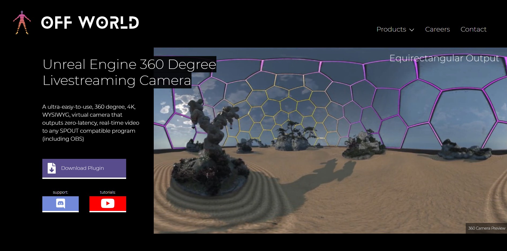
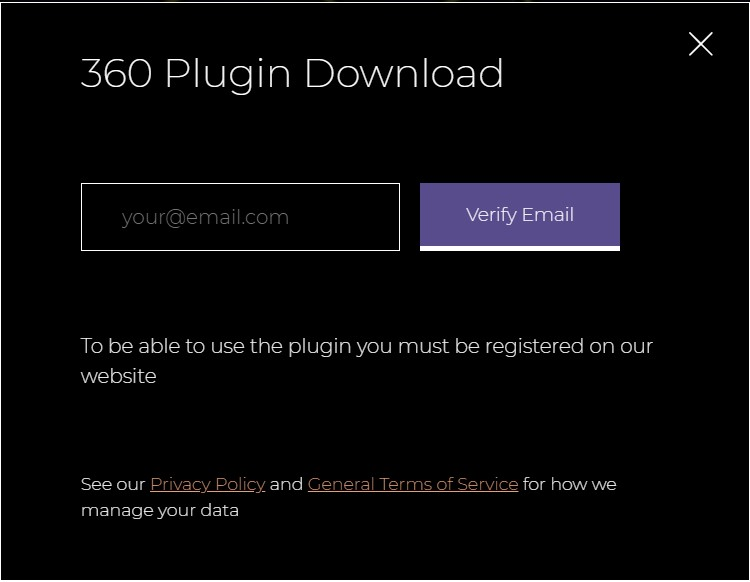
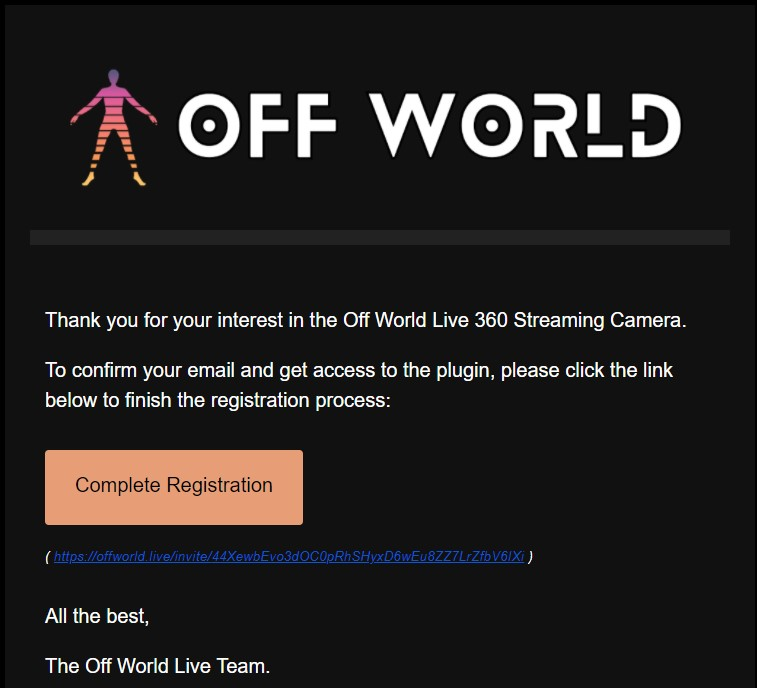
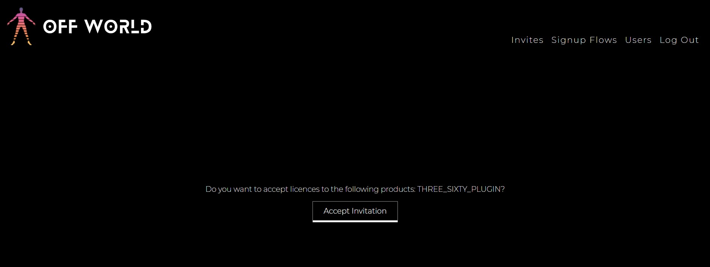
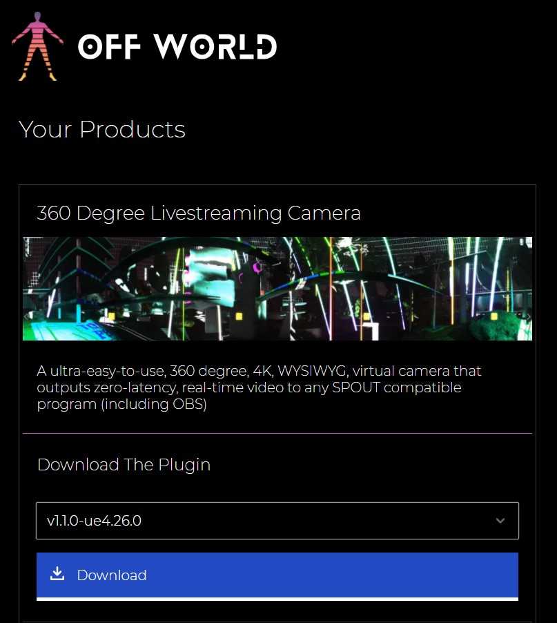
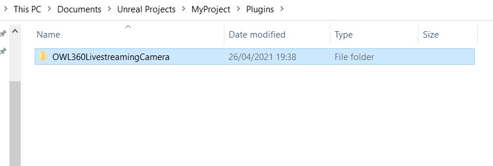
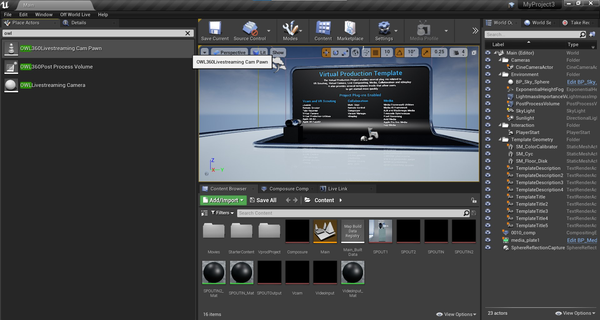

# Unreal Engine 360 degree Livestreaming Camera

This plugin enables you to live-stream a 360 degree video output from `Unreal Engine` `at-Runtime` to any [`Spout` receiver program](https://spout.zeal.co/) including [`OBS Studio`](https://github.com/Off-World-Live/obs-spout2-source-plugin)

It is compatible with `DirectX11` and `DirectX12` (for ray-tracing) and has a custom 360 degree `Bloom` post-processing algorithm/ pipeline for seamless `Bloom` in 360 degrees.

Video tutorials for installing and using the camera [can be found here](https://www.youtube.com/playlist?list=PLElT6SIg9JnC3ejNkhM4QofbkoXKHkuKQ)

## Registration

1. When you select to `Download Plugin` you will be asked to register your email.

2. Input your email into the pop-up box.

3. You will receive an email with a box to `Complete Registration`

4. Please accept the invitation to be taken to the `Download Page`.

5. Please select the plugin you want to download.

## Unreal Installation

1. Find the plugin in your `Downloads` folder and unzip. 
2. Ensure that all instances of your `Unreal Project` are closed.
3. If you do not have any `Plugins` installed in your project then create a new `Plugins` folder in your `Project` folder and copy the unzipped plugin inside.
4. If you already have `Plugins` in your project then copy the unzipped `OWL360LivestreamingCamera` folder into the existing `Plugins` folder in your `Project`.
5. When installed correctly, the folder structure should read [`Myproject`]/`Plugins`/`OWL360LivestreamingCamera`]

## SPOUT Plugin for OBS

In order to stream the output from `Unreal Engine` to the Internet:

1. [Install `OBS Studio`](https://obsproject.com/download)
2. Install our [`Spout2 Source Plugin for OBS Studio (64bit)`.](https://github.com/Off-World-Live/obs-spout2-source-plugin/releases) 
3. See [installation guide here](https://docs.google.com/document/d/1jPyk8CN7-zeqZnV8f6GvZfuCs2_x1qDbmZRGIL4eI8g)

## Unreal Configuration

1. Open your `Unreal` `Project` and, in the `Place Actors` window, search for `OWL360Livestreaming Cam Pawn`, select it and drop it into your scene.

2. To use the camera you need to use the Unreal Game Mode. This is done with Settings -> World Settings -> GameMode Override -> OWLGameModeBase. If you are using the OWL game mode you can skip to Point 5.
2. If you have an existing GameMode class that you would like to use, you can change its parent to the OWLGameModeBase instead: Open your GameMode blueprint -> Class Settings -> Parent Class. Then follow the steps in 3 to ensure that the camera appears in your viewport

3. Now go to Class Defaults in your GameMode Blueprint and change HUD Class to HUDGlobal (our class) Player Controller Class to OWLPlayerController.

4. Now select your own GameMode in World Settings (as explained in Point 1).
5. The camera is now active in the level and you need to authenticate your account to use it to output video. When you click `Play` in the Editor view, you will be requested to login to the Off World Live console (internet access required). 

6. Once you have logged in, the output of the 360 Camera will automatically appear in your viewport (which is now a WYSIWYG preview of the 360 output).

7. In the `World Editor` window you can click on `OffWorldLive360Camera` as an `Actor` and change its settings in the `Details` panel.

## 360 Camera Properties (Found in the Unreal Details Panel)

### `Viewport`

*   At runtime, the viewport transforms into a live WYSIWG preview of the 360 video output. 

*   You can use the mouse to move the orientation of the viewport.
*   The bottom central disc shows the camera orientation and can be clicked to return to your original position.

Colour/ Visual Output Adjustments

*   It is recommended to make colour adjustments at runtime (press Play) using the WYSIWYG viewport to test your visual output. In order to save your selections, right click the OWL360 camera in World Outliner and select Keep Simulation Changes. When you leave runtime (press Stop) your changes will be retained.

>>>>>  gd2md-html alert: inline image link here (to images/image11.png). Store image on your image server and adjust path/filename/extension if necessary.  (<a href="#">Back to top</a>)(<a href="#gdcalert12">Next alert</a>) >>>>> 

### `Camera Name`

You can set the camera name as you would like it to appear as a source in output programmes (OBS/ Spout receivers).

### `View Orientation` and `Camera Motion`

*   The default camera movement is as a pawn in Unreal (only moves when direction buttons are being pressed). 
*   There is also an option (checkbox) for cinematic movement where the camera can be set to move at a constant pace in a certain direction.
*   Ease time, increments, max speed and rotation speed can also be set.
*   You can modify the camera motion using the controls in the details panel.

>>>>>  gd2md-html alert: inline image link here (to images/image12.png). Store image on your image server and adjust path/filename/extension if necessary.  (<a href="#">Back to top</a>)(<a href="#gdcalert13">Next alert</a>) >>>>> 

*   By default, the camera moves using the direction of the pawn as it is orientated in the level (not the direction of the viewport). 
*   If you are controlling the camera live, check `View direction is forward` so the camera moves where you are looking towards in the viewport.

### Camera Movement

The camera can be moved using the keyboard (the below preset keys can be customised in the details panel):

>>>>>  gd2md-html alert: inline image link here (to images/image13.png). Store image on your image server and adjust path/filename/extension if necessary.  (<a href="#">Back to top</a>)(<a href="#gdcalert14">Next alert</a>) >>>>> 

### `360 Output Projection Formats`

You can choose between `Cubemap` and `Equirectangular` streaming formats.

>>>>>  gd2md-html alert: inline image link here (to images/image14.png). Store image on your image server and adjust path/filename/extension if necessary.  (<a href="#">Back to top</a>)(<a href="#gdcalert15">Next alert</a>) >>>>> 

### `Stream Resolution`

>>>>>  gd2md-html alert: inline image link here (to images/image15.png). Store image on your image server and adjust path/filename/extension if necessary.  (<a href="#">Back to top</a>)(<a href="#gdcalert16">Next alert</a>) >>>>> 

Available output streaming resolutions are:

| Resolution | Equirectangular (16:9) |Cubemap (3:2) |
| ---| ---- | ---|
|240p |426x240 |360x240 |
|360p | 640x360 | 540x360 |
| 480p | 854x480 |720x480 |
| 720p | 1280x720 | 1080x720 |
| 1080p| 1920x1080| 1620x1080|
| 1440p/ 2k | 2560x1440|2160x1440 |
| 4k | 3840x2160 | 3240x2160 |

### Post Process Settings

*   All the post-processing settings that work for 360 output are included in the list in the details panel. 
*   Settings that create seams are hidden (apart from screen-space reflections).
*   There is a custom bloom function which is seamless for 360 content but needs to be adjusted to create the same visual output as the Unreal bloom. This can be selected in the details panel here as an alternative to the standard UE pipeline:

>>>>>  gd2md-html alert: inline image link here (to images/image16.png). Store image on your image server and adjust path/filename/extension if necessary.  (<a href="#">Back to top</a>)(<a href="#gdcalert17">Next alert</a>) >>>>> 

*   Ray-tracing is required to obtain correct reflections (screen-space reflections are available but produce edge artefacts.)

>>>>>  gd2md-html alert: inline image link here (to images/image17.png). Store image on your image server and adjust path/filename/extension if necessary.  (<a href="#">Back to top</a>)(<a href="#gdcalert18">Next alert</a>) >>>>> 

### Post Process Volumes

*   There is a bespoke post-process volume for the 360 camera. 
*   This can be added as a separate Actor from the Place Actors panel.
*   The post process volume includes all post-processing settings that are available for the 360 camera.

>>>>>  gd2md-html alert: inline image link here (to images/image18.png). Store image on your image server and adjust path/filename/extension if necessary.  (<a href="#">Back to top</a>)(<a href="#gdcalert19">Next alert</a>) >>>>> 

*   Existing post process volumes should be checked in the 360 viewport as certain settings are disabled automatically to ensure the proper functioning of the camera.

## Optimisation
### CPU Usage in Unreal

*   In Editor Preferences in Unreal Engine, please ensure that the box below is unticked. 
*   Without this, you may find that your stream slows down when you have OBS rather than Unreal running in the foreground on your computer.

>>>>>  gd2md-html alert: inline image link here (to images/image19.png). Store image on your image server and adjust path/filename/extension if necessary.  (<a href="#">Back to top</a>)(<a href="#gdcalert20">Next alert</a>) >>>>> 

## Output
### Delivering to SPOUT

The camera can be used to output to any SPOUT receiver and converts DX12 textures to DX11 so they are compatible with SPOUT (so ray-tracing can be used):

*   To test with SPOUT you can [download the SPOUT receiver here](https://leadedge.github.io/spout-download.html).
*   You need to ensure that the GPU running the SPOUT receiver program is the same as the GPU running Unreal Engine.
*   To do so, click the `Spout Receiver` programme included in the SPOUT download folder and select the correct GPU from the drop down menu.

>>>>>  gd2md-html alert: inline image link here (to images/image20.png). Store image on your image server and adjust path/filename/extension if necessary.  (<a href="#">Back to top</a>)(<a href="#gdcalert21">Next alert</a>) >>>>> 

### Delivering to OBS

First, please follow the instructions for installing the [Spout to OBS plugin](https://docs.google.com/document/d/1jPyk8CN7-zeqZnV8f6GvZfuCs2_x1qDbmZRGIL4eI8g) 

### Streaming from OBS to Internet Locations

At present 360 video can be live-streamed to Facebook and YouTube live and certain custom delivery solutions. 

1. In OBS click `Settings` in the bottom right hand corner and in the `Settings` window click `Stream`.
2. In the `Stream` section, select from the `Service` dropdown menu where you would like to stream to.
3. Follow the instructions of your selected streaming platform (including acquiring a stream key) and paste the stream key into the `Stream Key` box.
4.  Click `Apply` to close the `Settings` window and return to the main OBS window.
5. When you are ready to stream from OBS select `Start Streaming` in the bottom right hand corner.

Setting recommendations for streaming 4K to YouTube:

1. Ensure that you are using the `NVEnc` video encoder (in the output tab).
2. Enable `Advanced Settings` and set the bit rate to at least 30000 Kbs - (ie 30Mbs) with CBR.
3. Ensure that the keyframe interval is not 0 - 4 seems to be a good interval for YouTube.

## Technical Considerations

### System Requirements

*   The 360 camera is graphically intensive so more powerful graphics cards are required to deliver higher resolution output at a high frame rate. 
*   A high upload speed is also required to live-stream at higher resolutions.
*   On desktop devices a resolution less than 2k can look pixelated, 1080px is still effective on mobile devices.
*   For ray-tracing RTX (or other compatible graphics cards) are required. Please see more information [here](https://docs.unrealengine.com/en-US/Engine/Rendering/RayTracing/index.html).

**Minimum Internet Upload Speeds: **

*   1080px/ 30fps: +7.5 mbps
*   2k/ 1440px/ 30fps: +15mbps
*   4k/ 30fps: +30mpbs

### Recommended System Specifications

*   Dedicated GPU: 2080Ti or equivalent
*   CPU: Intel i9-9900k or equivalent
*   RAM: 16GB
*   Operating System: Windows 8 or later

## Copyright

Copyright © 2021 Off World Live Limited. All rights reserved.
