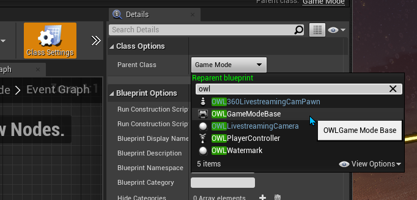

# Unreal Engine 360 degree Livestreaming Camera

This plugin enables you to live-stream a 360 degree video output from `Unreal Engine` `at-Runtime` to any [`Spout` receiver program](https://spout.zeal.co/) including [`OBS Studio`](https://github.com/Off-World-Live/obs-spout2-source-plugin)

It is compatible with `DirectX11` and `DirectX12` (for `Ray-Tracing`) and has a custom 360 degree `Bloom` `Post-Processing` algorithm for `Seamless 360 Bloom`.

Video tutorials for installing and using the camera [can be found here](https://www.youtube.com/playlist?list=PLElT6SIg9JnC3ejNkhM4QofbkoXKHkuKQ)

## Download and Setup

### Email Registration

1. When you select to `Download Plugin` you will be asked to register your email.

2. Input your email into the pop-up box.

3. You will receive an email with a box to `Complete Registration`

4. Please accept the invitation to be taken to the `Download Page`.

5. Please select the plugin you want to download.

### Unreal Installation

1. Find the plugin in your `Downloads` folder and unzip. 
2. Ensure that all instances of your `Unreal Project` are closed.
3. If you do not have any `Plugins` installed in your project then create a new `Plugins` folder in your `Project` folder and copy the unzipped plugin inside.
4. If you already have `Plugins` in your project then copy the unzipped `OWL360LivestreamingCamera` folder into the existing `Plugins` folder in your `Project`.
5. When installed correctly, the folder structure should read [`Myproject`]/`Plugins`/`OWL360LivestreamingCamera`]

### Unreal Configuration

1. Open your `Unreal` `Project` and, in the `Place Actors` window, search for `OWL360Livestreaming Cam Pawn`, select it and drop it into your scene.

2. To use the `360 Camera` you need to change the `Unreal` `GameMode`. Go to `Settings`>`World Settings`>`GameMode Override` and select `OWLGameModeBase`. If you are using this `OWL Gamemode` you can skip to Point 5, if you are using your own `GameMode` please follow the points below.

2. If you have an existing `GameMode` class, change its `Parent` to the `OWLGameModeBase` in `GameMode` `Blueprint`>`Class Settings`>`Parent Class`.

3. Now go to `Class Defaults` in your `GameMode` `Blueprint` and change `HUD Class` to `HUDGlobal` (our class) and `Player Controller Class` to `OWLPlayerController`.

4. Ensure that whatever `GameMode` you were previously using is selected in `World Settings` (as explained in Point 1).

### Account Authentication

1. The `360 Camera` is now active in the level and you need to authenticate your account to use it to output video. 
2. When you click `Play` in the `Editor` view, you will be requested to login to the `Off World Live` console (internet access required). 

3. Once you have logged in, `at Runtime` the output of the `360 Camera` will automatically appear in your `Viewport` (which is now a `WYSIWYG` preview of the 360 output).

## SPOUT Plugin for OBS

In order to stream the output from `Unreal Engine` to the Internet:

1. [Install `OBS Studio`](https://obsproject.com/download)
2. Install our [`Spout2 Source Plugin for OBS Studio (64bit)`.](https://github.com/Off-World-Live/obs-spout2-source-plugin/releases) 
3. See [installation guide here](https://docs.google.com/document/d/1jPyk8CN7-zeqZnV8f6GvZfuCs2_x1qDbmZRGIL4eI8g)

## 360 Camera Features

### WYSIWYG 360 Viewport

-   `At runtime`, the `Viewport` transforms into a live `WYSIWG preview` of the 360 video output. 
-   You can use the mouse to move the orientation of the viewport.
-   The bottom central disc shows the camera orientation and can be clicked to return to your original position.

### Colour Adjustments

-  The `360 Camera` uses the `Scene Capture 2D` rendering pipeline and so will have some colour differences from your `Viewport`. 
- The `360 Viewport` that appears `at Runtime` is colour correct (`WYSIWYG`) and so should be used to make colour adjustments and test your visual output. 
- In order to save your selections `at Runtime`, right click the `OWL360 Camera` in `World Outliner` and select `Keep Simulation Changes`. 
- When you leave `Runtime` (press `Stop`) your changes will be retained.

### Output Formats and Resolutions

- You can choose between `Cubemap` and `Equirectangular` streaming formats.
- `Cubemap Bleed Percent` should be set depending on your output player settings requirements but is set at the default value for delivery to `Facebook`.

- Available output streaming `Resolutions` are:

    | Resolution | Equirectangular (16:9) |Cubemap (3:2) |
    |---|----|---|
    |240p |426x240 |360x240 |
    |360p | 640x360 | 540x360 |
    | 480p | 854x480 |720x480 |
    | 720p | 1280x720 | 1080x720 |
    | 1080p| 1920x1080| 1620x1080|
    | 1440p/ 2k | 2560x1440|2160x1440 |
    | 4k | 3840x2160 | 3240x2160 |

### Camera Name

- You can set the `360 Camera` name as you would like it to appear as a source in output programmes (OBS/ Spout receivers).

### Seamless 360 Bloom

-   There is a custom `Seamless 360 Bloom` post-processing effect which is seamless for 360 content but does not pass through the `Unreal` `Tonemapper`.  
- To compensate for missing the `Tonemapper` you need to make colour adjustments to create the same visual output as the `Unreal` `bloom`. 
- If you don't need `bloom` in your content then you can select the standard `Tonemapper` rendering pipeline.

### View Orientation and Camera Motion

-   The default `360 Camera` movement is as a `Pawn` in `Unreal` (only moves when direction buttons are being pressed). 
-   There is also a checkbox for `Cinematic Movement` where the camera can be set to move at a constant pace in a certain direction.
-   If you are controlling the camera live, check `View Direction is Forward` so the camera moves where you are looking towards in the `Viewport`.
-   `Ease time`, `Increments`, `Max speed` and `Rotation` speed can also be set.

### Movement Keys

- The `360 Camera` can be moved using the keyboard (the below preset keys can be customised in the details panel or via `Blueprints`):

### Post Process Settings

-   All the `Post-Processing` settings that work for 360 output are included in the list in the `Details` panel. 
-   Settings that create seams are hidden (apart from `Screen Space Reflections` which are advised against as they produce edge artefacts.).
-   `Ray-tracing` is required to obtain correct reflections.

### Post Process Volumes

-   There is a bespoke `Post-Process volume` for the `360 camera`. 
-   This can be added as a separate `Actor` from the `Place Actors` panel.
-   The `360 Post Process Volume` includes all `Post-Processing` settings that are available for the `360 camera`.
-   Existing post process volumes should be double-checked in the `360 Viewport` as certain settings are disabled automatically to ensure the proper functioning of the `360 Camera`.

## Optimisation

### CPU Usage in Unreal

-   In Editor Preferences in Unreal Engine, please ensure that the box below is unticked. 
-   Without this, you may find that your stream slows down when you have OBS rather than Unreal running in the foreground on your computer.

### GPU Usage in Unreal

- The `360 Camera` is graphically intensive so more powerful graphics cards are required to deliver high resolution output at high frame rates.
- For the highest performance, it is recommended to shrink the `Resolution` of the `Unreal` `Viewport` to the smallest tolerable (this will not affect the output of the camera but will reduce the rendering required from the Engine.)

## Troubleshooting Spout

- [`Spout`](https://spout.zeal.co/) is the solution used by the plugin to share video textures between `Unreal` and other programs.
- There will always be a `Spout Sender` which is the program outputting the video and a `Spout Receiver` which is the program receiving the video.
- If your video feed does not automatically appear in your desired program it is normally because either `Sender` or `Receiver` has an issue.
- You can troubleshoot `Spout` using the tips below:
1. Download the demo `Spout` sender/ receiver [here](https://leadedge.github.io/spout-download.html) to see whether it is the `Sender` program or the `Receiver` program that is not working with `Spout`.
2. Ensure that `Unreal` and your other program are running on the same GPU (this is an issue with some laptops). To deal with this:
    a. Check `Windows` `Task Manager` to see which `GPU` your programs are running on - [guide here](https://www.digitalcitizen.life/7-ways-launch-task-manager-windows-8/)
    b. [Use the guide here](https://www.itechtics.com/use-specific-gpu/#:~:text=Click%20on%20Graphics%20Settings.,run%20on%20a%20dedicated%20GPU.) to force your program to use a specific `GPU`.
3.  Ensure that the programmes you are sharing between are also in `High Performance` mode if your computer has any performance throttling (this can be common on laptops).
4. For any other issues [contact us on `Discord`](https://discord.gg/2PaMtnK)

## Streaming in 360 from OBS

- At present 360 video can be live-streamed to `Facebook` and `YouTube` live and certain custom delivery solutions. 
- Setting recommendations for streaming `4K` to `YouTube`:

    1. Ensure that you are using the `NVEnc` video encoder (in the output tab).
    2. Enable `Advanced Settings` and set the bit rate to at least 30000 Kbs - (ie 30Mbs) with CBR.
    3. Ensure that the `Keyframe Interval` is not 0. 4 seems to be a good interval for `YouTube`.

## System Requirements

### General Recommendations

-  On desktop devices a resolution less than `2K` can look pixelated. `1080px` is still effective on mobile devices.
-   A high upload speed is required to live-stream at higher resolutions.
- A high bitrate will help reduce compression introduced into the image by encoding/ decoding (but requires a high upload speed).

### Upload Speeds/ Resolutions

| Resolution | Minimum Upload Speed |
| ---| ---- |
|1080 |+7.5 mpbs |
|2K |+15 mpbs |
|4K |+30 mpbs |

### Recommended Hardware/ Software

*   Dedicated GPU: 2080Ti or equivalent
*   CPU: Intel i9-9900k or equivalent
*   RAM: 16GB
*   Operating System: Windows 8 or later

## Copyright

Copyright © 2021 Off World Live Limited. All rights reserved.
