# Unreal Engine Livestreaming Toolkit

This plugin enables you to manage sending and receiving multiple real-time video inputs/outputs to/from Unreal Engine in-Editor or at Runtime to/ from [any SPOUT compatible programme](https://spout.zeal.co/) including [OBS Studio (64bit)](https://github.com/Off-World-Live/obs-spout2-source-plugin)

It is compatible with all significant Unreal creative tools including (but not limited to): Cinecam, Composure, DLSS, Virtual Camera plugin, Livelink etc.

SPOUT allows Windows users to share video feeds between programmes running on the same GPU with no computational overhead, compression or latency, making it the best way to stream realtime-video from a single machine.

For any support or further questions, [please get in touch on our discord channel.](https://discord.gg/2PaMtnK)

---
# Download

## Unreal Plugin

<<<<<<< HEAD
1.  
2. Download and unzip the downloaded plugin.
=======
## Installation 

### Unreal SPOUT Plugin Installation

#### Download the Plugin

1. Download and unzip the downloaded plugin.

#### Adding the Plugin to your Unreal Project

1. Ensure that all instances of your Unreal Project are closed.
2. If you do not have any Plugins installed in your project then create a new `Plugins` folder in your `Project` folder and copy the unzipped plugin inside.
3. If you already have Plugins in your project then open the `Plugins` folder to find the `OWLLivestreamingCamera` folder and copy it into the existing `Plugins` folder in your Project.

4. When installed correctly, the folder structure should read [Myproject]/Plugins/OWLLivestreamingCamera.]

### OBS SPOUT Plugin Installation
>>>>>>> a6cac9f2534ddc26ee6242e96d53acfd36cc7540

## OBS-to-SPOUT Plugin

In order to stream the output from Unreal Engine to the Internet:

1. [Install OBS Studio](https://obsproject.com/download)
<<<<<<< HEAD
2. Install our [Spout2 Source Plugin for OBS Studio (64bit).](https://github.com/Off-World-Live/obs-spout2-source-plugin/releases) 
3. See [Installation guide here](https://docs.google.com/document/d/1jPyk8CN7-zeqZnV8f6GvZfuCs2_x1qDbmZRGIL4eI8g)
---
=======
2. Install our `Spout2 Source Plugin for OBS Studio (64bit)`: [https://github.com/Off-World-Live/obs-spout2-source-plugin/releases](https://github.com/Off-World-Live/obs-spout2-source-plugin/releases) and [installation guide here](https://docs.google.com/document/d/1jPyk8CN7-zeqZnV8f6GvZfuCs2_x1qDbmZRGIL4eI8g)

## SPOUT Sender Manager
>>>>>>> a6cac9f2534ddc26ee6242e96d53acfd36cc7540

# Installation

## Add the Plugin to your Unreal Project

1. Ensure that all instances of your Unreal project are closed and that you are connected to the internet.
2. If you do not have any `Plugins` installed in your project then create a new `Plugins` folder in your `Project` folder and copy the unzipped plugin inside.

3. If you already have `Plugins` in your project then open the `Plugins` folder to find the `OWLLivestreamingToolkit` folder and copy it into the existing `Plugins` folder in your `Project`.

4. When installed correctly, the folder structure should read `Project`/Plugins/OWLLivestreamingToolkit.
5. Open your Unreal project and you will see an `Off World Live` icon above your viewport. Click it and you will be taken to login.
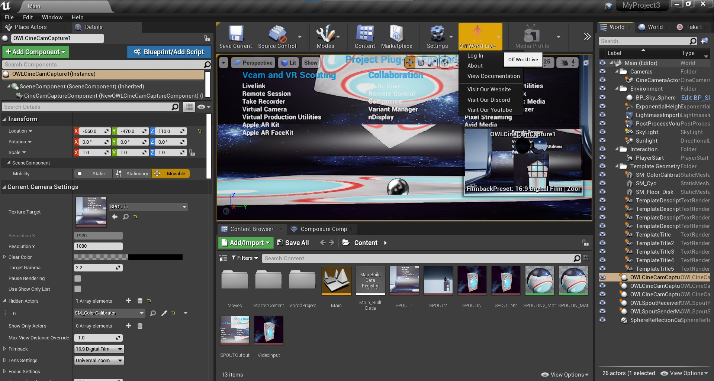
6. You will be taken to the browser to login.
 
7. Validate your login and you will be returned to Unreal.

---
# Setup Overview

There are three main components to the toolkit:
1. The `Spout Sender Manager` which allows you to live-stream any Unreal `Render Target` from Unreal via `Spout`.
2. The `Spout Receiver Manager` which allows you to receive any real-time video feeds from `Spout` in Unreal.
3. The `OWL Cinecam` which allows you to output an Unreal `Cinecam` to a `Render Target` for use either with the `Spout Sender Manager` or in other Unreal processes.

---
# SPOUT Sender Manager

- The `SPOUT Sender Manager` is an Unreal `Actor` that you use to manage different real-time Spout video ouputs from Unreal. 
- It allows you to output any `Render Target` from Unreal to Spout (such as those from `OWL Cinecam`, `Composure` or `Virtual Camera Plugin`)
- It works both `in-Editor` and `at-Runtime` and can be controlled through `Blueprints`.  
- Please install as follows:

1. Find the `OWLSpoutSenderManager` `Actor` in the `Place Actors`panel and drag it into your scene.
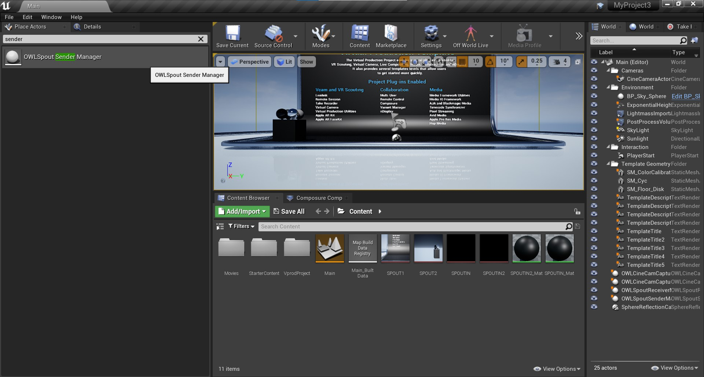
2. In `World Outliner`select `OWLSpoutSenderManager`so it opens in your `Details` panel.
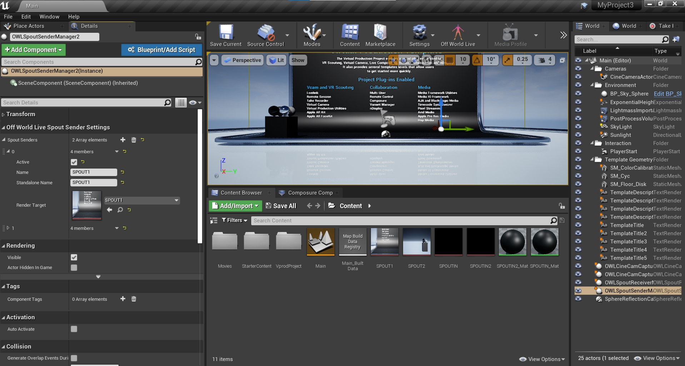
3. In your `Details` panel add a `Spout Sender` `Array Element` and click the arrow in the right hand corner to open the `Array Element` showing its `Members` (there are 4). 
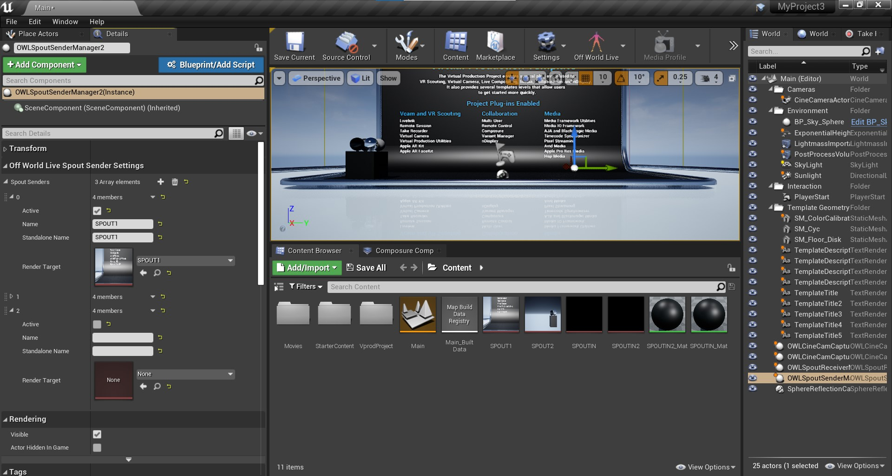
You need to:
 
    a.  Name your `Sender` and `Standalone Sender` as this is what your video feeds will be called in OBS/ your Spout receiver programme.
    b. Select/ create a `Render Target` by clicking the drop down (this can be from your `OWL Cinecam` as configured below or from another Unreal output.) 
    c. Click the `Active` box to begin sending to Spout.
 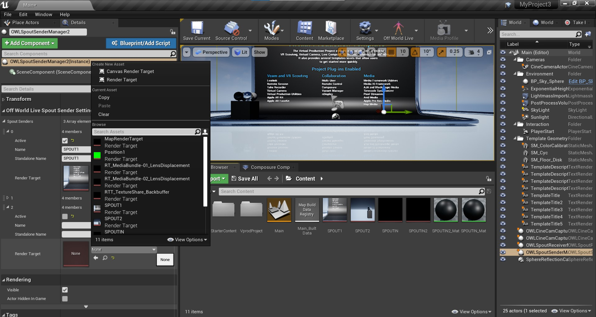
4. To stream multiple cameras, just add additional `Array Elements`.
5. You can use the `Active` tick-box to manage which cameras are rendering simultaneously and so reduce computational load.
---

# Spout Receiver Manager

- The `Spout Receiver Manager` is an Unreal `Actor` that you use to manage different real-time Spout video inputs to Unreal. 
- Inputs are managed as  `Render Targets` in the same way as the `Spout Sender`
- You need to create a `Material` from your `Render Target` to add the video input to `Actors` in your scene (explained below).
- It works both `in-Editor` and `at-Runtime` and can be controlled through `Blueprints`.  
- Please install as follows:

1. Find the `OWLSPOUTReceiverManager` `Actor` in the `Place Actors`panel and drag it into your scene.  

2. In `World Outliner`select `OWLSPOUTReceiverManager`so it opens in your `Details` panel.
3. In your `Details` panel add a `Spout Receiver` `Array Element` and click the arrow in the right hand corner to open the `Array Element` showing its `Members` (there are 3). 
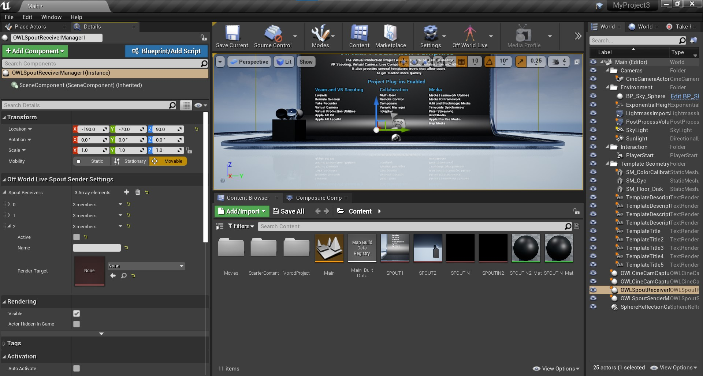
4. To receive your video input/s you need to:
    a. In `Content Browser` add a new `Render Target` by selecting: `Add/Import`> `Materials & Textures` > `Render Target`.

    b. Give your `Render Target` a name so you can identify it from the drop-down list in the `Spout Sender` `Array`
 
    c. Go back to your `Spout Receiver Manager` `Details` panel and select your newly added `Render Target` in your `Spout Receiver` `Array`
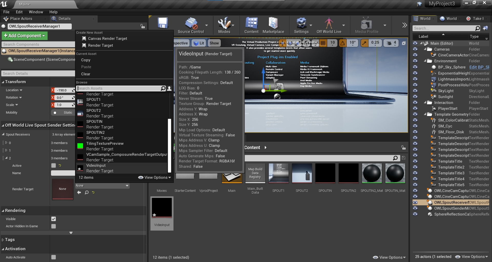
    d. Input the name of your `Spout Sender` video-feed. This needs to be **EXACTLY** the same as your `Spout Sender` in your external program otherwise it will not appear.
    e. Click the `Active` box to begin receiving the video-feed from your external `Spout Sender` (you should automatically see your input in the `Render Target` thumbnail.)
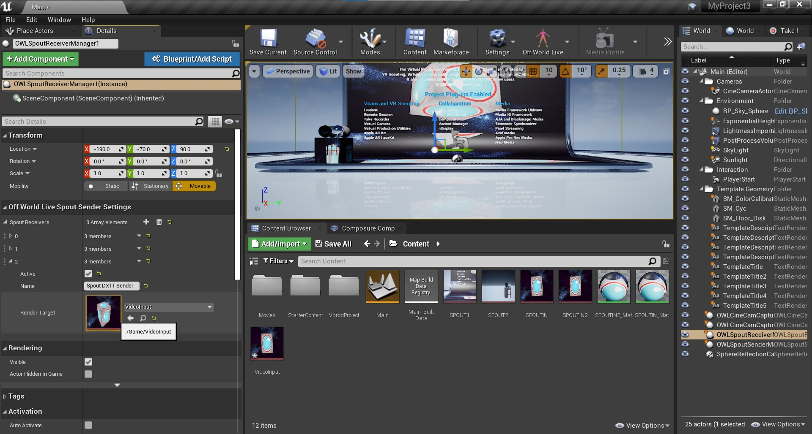
5. To add your video input/s to elements in your scene you need to:
    a. Create a `Material` from your `Render Target`: Right click on the `Render Target` you created in `Content Browser` (step 4.a) and choose `Create Material`.
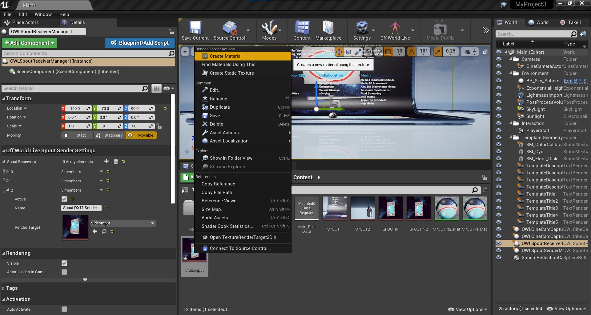
    b. Drag the newly created `Material` (which will be called the same as your `Render Target`) onto the elements in your level.

6. To receive multiple input feeds, just add additional `Array Elements`.
7. You can use the `Active` tick-box to manage which inputs are rendering simultaneously and so reduce computational load.

---
# OWL Cinecam

- The `OWL Cinecam` is a modified Unreal `Cinecam` that outputs to a `Render Target` and so can be used with our `Spout Sender Manager`to stream video from the `Cinecam` to `Spout`.
- It includes all normal `Cinecam` features in addition to certain `Scene Capture` features like `Alpha`and `Resolution`(see details below).
- Please install as follows:
1. Find the `OWLCine Cam Capture` `Actor` in the `Place Actors` panel and drag it into your scene.
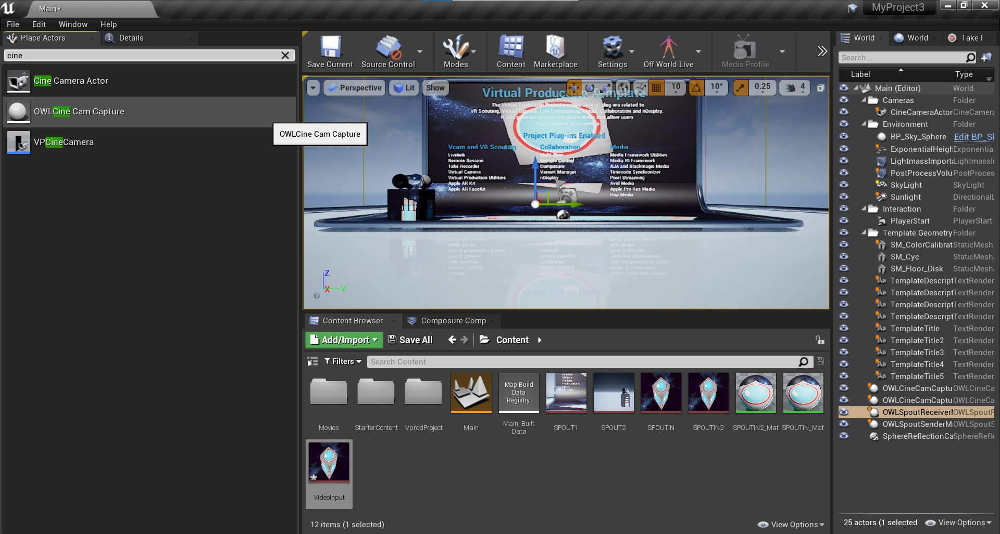
2. In `World Outliner`select `OWLCine Cam Capture`so it opens in your `Details` panel.
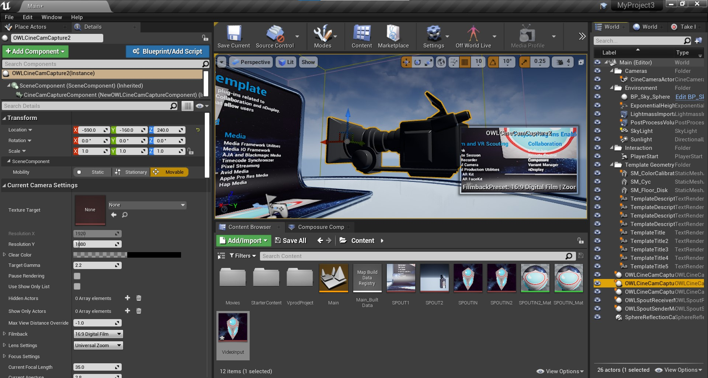
3. In your `Details` panel, create a `Render Target` to receive the video feed from your `OWL Cinecam` by clicking the dropdown next to `Texture Target` and selecting `Render Target`.
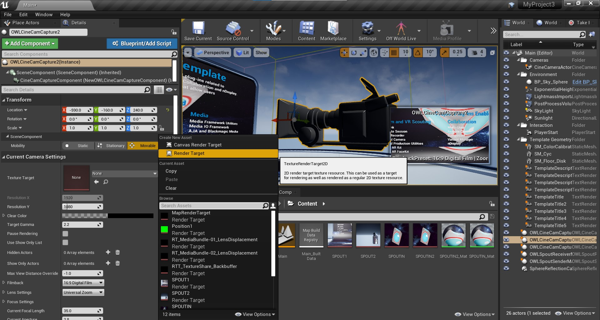 
4. Name your `Render Target` so that you can select it from the drop down list.
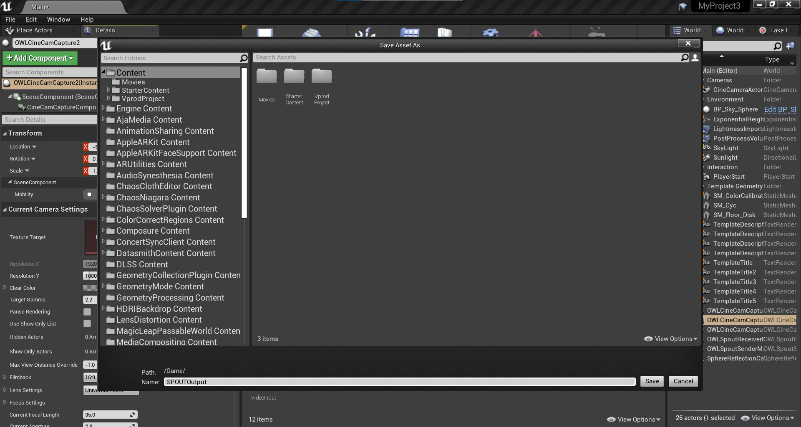 
5. You will now see your `Render Target` connected to your `OWL Cinecam`
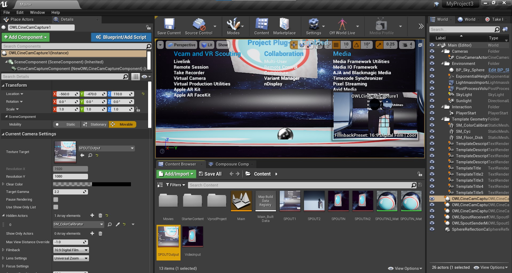 

---
## OWL Cinecam Features

- The `OWL Cinecam` combines features from the Unreal `Cinecam` and `Scene Capture 2D` to create a streaming camera that benefits from the features and rendering pipeline of `Cinecam`.

####Render Texture Target:
  
- You can select the `Render Texture Target` that you want to attach to the `OWL Cinecam` using the drop-down as described above in `OWL Cinecam` step 3.
- You can create multiple `Render Targets` and use `Blueprints` to switch between then as required.

<<<<<<< HEAD
####Resolution/ Aspect Ratio:
=======
1. In the Spout Sender Manager actor added above:
    1. Select OWLSpoutSenderManager in `World Outliner`
    2. In your Details panel add a Spout Sender `Array Element` and click the arrow in the right hand corner to open the Array Element showing its components/ members.
        
    3. Name your Sender and Standalone Sender (for standalone mode) as you need.
    4. Select your Render Target from the list using the drop-down in the same method used as for selecting the Render Target for your Cinecam above.
    5. Click the `Active` box on to begin sending to SPOUT.

>>>>>  gd2md-html alert: inline image link here (to images/image4.png). Store image on your image server and adjust path/filename/extension if necessary.  (<a href="#">Back to top</a>)(<a href="#gdcalert5">Next alert</a>) >>>>> 

2. To stream multiple cameras, just repeat the steps above and if you need to reduce computational load/ increase frame rate, use the `Active` tick-box to manage which cameras are rendering simultaneously.
3. The SPOUT sender can also be used to [live-stream a Render Target direct from Composure.](https://docs.unrealengine.com/en-US/WorkingWithMedia/Composure/QuickStart/index.html)

## SPOUT Receiver Manager

The OWL SPOUT Receiver Manager allows you to add multiple simultaneous SPOUT inputs and toggle them active/ inactive or control them through blueprints. You can configure it as follows:

1. Add the OWL SPOUT Receiver Manager to your scene
    1. In the `Place Actors` window, search for `OWLSpout Receiver Manager` and drag and drop it into your level.  

>>>>>  gd2md-html alert: inline image link here (to images/image5.png). Store image on your image server and adjust path/filename/extension if necessary.  (<a href="#">Back to top</a>)(<a href="#gdcalert6">Next alert</a>) >>>>> 

2. For each each SPOUT input you need, create a Render Texture Target by:
    2. In `Content Browser` add a new `Render Target` by selecting: Add/Import-> Materials & Textures -> Render Target.
    3. Give your Render Target a name so you can identify it later.

>>>>>  gd2md-html alert: inline image link here (to images/image6.png). Store image on your image server and adjust path/filename/extension if necessary.  (<a href="#">Back to top</a>)(<a href="#gdcalert7">Next alert</a>) >>>>> 

3. Add a SPOUT receiver for each SPOUT input you need:
    4. Select your OWL SPOUT Receiver Manager in World Outliner.
    5. In its Details panel for your SPOUT Receiver you need to create a new receiver for each of your SPOUT inputs using the array.

>>>>>  gd2md-html alert: inline image link here (to images/image7.png). Store image on your image server and adjust path/filename/extension if necessary.  (<a href="#">Back to top</a>)(<a href="#gdcalert8">Next alert</a>) >>>>> 

    6.  Opening a new array will create three members:
        1. Active should be toggled on if you want your SPOUT input to show.
        2. Name needs to be EXACTLY the same as your SPOUT sender in your external program.
        3. Render Target should select the Render Texture Target you added in step 2 which will display your SPOUT input.
    7. Provided the name you input in ii. is the same as in your external programme, you should automatically see your SPOUT input in the Render Target thumbnail. 
4. Create a material from your Render Texture and add it to elements in your level:
    8. Right click on your SPOUT Render Target in Content Browser (which you created in step 2) and choose `Create Material`.

>>>>>  gd2md-html alert: inline image link here (to images/image8.png). Store image on your image server and adjust path/filename/extension if necessary.  (<a href="#">Back to top</a>)(<a href="#gdcalert9">Next alert</a>) >>>>> 

    9. Drag the newly created material (which will be called the same as your Render Target) onto the element/s in your level you want to show your video texture.

>>>>>  gd2md-html alert: inline image link here (to images/image9.png). Store image on your image server and adjust path/filename/extension if necessary.  (<a href="#">Back to top</a>)(<a href="#gdcalert10">Next alert</a>) >>>>> 

## Cinecam

### Cinecam SPOUT Actor

The Cinecam requires two Unreal actors to work:

1. The OWL Cine Cam Capture
1. Open your Unreal Engine Project and, in the `Place Actors/ Modes` window, search for `OWLCine Cam Capture`
2. Select this item and drop it into your Unreal viewport.
3. Repeat this for the `OWL Spout Sender Manager

### Cinecam Render Target

1. You need to assign a Render Target to your Cinecam. You can do this by selecting it in the `World Outliner` list and then in the `Details` panel clicking the drop-down next to `Texture Target` and selecting `Create New Asset` -> `Render Target`.

>>>>>  gd2md-html alert: inline image link here (to images/image10.png). Store image on your image server and adjust path/filename/extension if necessary.  (<a href="#">Back to top</a>)(<a href="#gdcalert11">Next alert</a>) >>>>> 

2. A pop-up will appear and you can name your Render Target. Save this. Your cinecam now will be rendering from this. 

>>>>>  gd2md-html alert: inline image link here (to images/image11.png). Store image on your image server and adjust path/filename/extension if necessary.  (<a href="#">Back to top</a>)(<a href="#gdcalert12">Next alert</a>) >>>>> 

3. Your Render Target will be saved in your `Content Browser` and you can create multiple Render Targets if you like and attach them to your Cinecam using the drop-down list of Render Targets shown above.

>>>>>  gd2md-html alert: inline image link here (to images/image12.png). Store image on your image server and adjust path/filename/extension if necessary.  (<a href="#">Back to top</a>)(<a href="#gdcalert13">Next alert</a>) >>>>> 

4. You can also[ output a Render Target from Composure](https://docs.unrealengine.com/en-US/WorkingWithMedia/Composure/QuickStart/index.html) direct to the Owl Cinecam
>>>>>>> a6cac9f2534ddc26ee6242e96d53acfd36cc7540

- The `OWL Cinecam` has both a `Resolution` and an `Aspect Ratio`.
 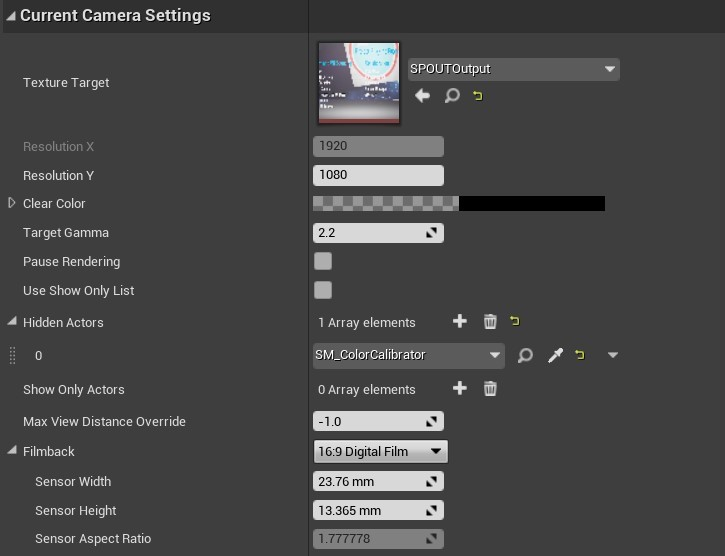 
- The `Aspect Ratio` is controlled through the standard `Cinecam` `Filmback` settings in the `Details` panel and changes the size of the `Render Target`.
- The `Resolution` is locked to the `Aspect Ratio` so you can only increase/ decrease the `Y-Value` (which will automatically set the correct proportionate `X-Value`). 
- To disconnect `Resolution` from `Aspect Ratio` you can untick `Constrain Aspect Ratio` in the `Camera Options` section of the `Details` panel. N.B. this will create a distorted output.
 

####Render Target Clear Color/ Gamma

- The `Render Target` `Gamma` is exposed in the `Details` panel and set to 2.2 as this is the optimal colour setting for streaming.  
- The `Clear Colour` settings can be used to change the default colour of the `Render Texture`  (e.g. if you want to send a green screen background for keying in `OBS Studio`).
 

####Pause Rendering:

-   This enables you to `Pause Rendering` on the `OWL Cinecam` which is useful for saving GPU power when using live-editing.
-   This will stream a static/ paused image if `Pause Rendering` is selected in the `OWL Cinecam` `Details` panel and `Active` is selected in the `Spout Sender Manager` (for that `OWL Cinecam`). This is useful if you want to see the viewport of your different cameras but only render a live video-feed from a single camera at a time).
 

####Use Show Only/ Hidden Actors:

-   `Show Only` is used to select specific `Actors` to appear in an alpha channel output.
-   `Hidden Actors` can be used to select `Actors` in your scene and stop them from being rendered into your output.
-  Both require a post-process volume (see full guide below).
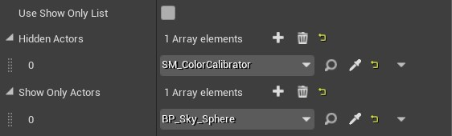 

<<<<<<< HEAD
####Max View Distance Override:

*   This can be used to cull distant objects from a reflection.
 

####Standard Cinecam Features:

*   The `OWL Cinecam` also includes the following standard `Cinecam` features which can be used to select properties such as `Aspect Ratio` and `Depth of Field`:
    *   `Filmback`
    *   `Lens Settings`
    *   `Focus Settings`
    *   `Focal Length`
    *   `Aperture`
    *   `Lookat tracking settings`
    *  `Horizontal Field of View`
 

---
## Depth of Field

- The `OWL Cinecam` includes all the of the `Depth of Field` capabilities from the Unreal `Cinecam` which are split across the `Current Camera Settings` and `Post Process` sections.
- For more information about `Depth of Field` [please see the Unreal guidelines here](https://docs.unrealengine.com/en-US/RenderingAndGraphics/PostProcessEffects/DepthOfField/CinematicDOFMethods/index.html)

---
## Post Processing

The `OWL Cinecam` uses the `Viewport` rendering pipeline from Unreal and so can take advantage of `Temporal Anti-Aliasing`, `TAA Motion Blur` and `TAA Upsampling`.
-   All of these can be disabled via the tick-boxes in the `OWL Cinecam` details panel.
-   All other post-process settings are as standard for the `OWL Cinecam`.

---
## Alpha Channel Output

You can select specific `Actors` to show/ hide (but only `Actors`, not `Components` or `Instance Meshes`) using the `Hidden Actors` and `Show Only Actors` `Arrays` as follows:

1. Go to `Project Settings` in your `Editor`
 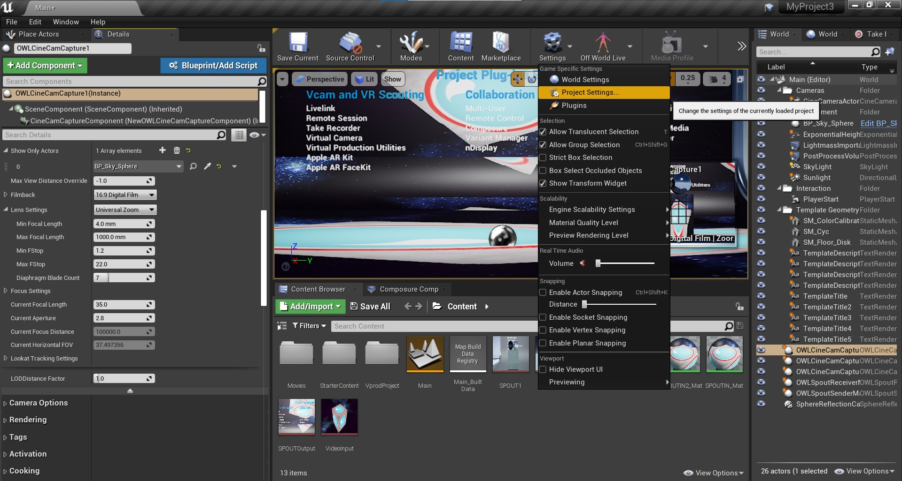
2. find `Enable alpha channel support` in `Engine - Rendering/ Postprocessing` and set it to `AllowThroughTonemapper` (you will be asked to restart your level).

3. If you don’t have a `Post Process Volume` in your scene then [follow these instructions](https://subscription.packtpub.com/book/game_development/9781784391966/4/ch04lvl1sec24/adding-post-process) to add one. Then:
    a. Select your `Post Process Volume` in `World Outliner`.
    b. In its `Details` panel go to `Rendering Features`/ `Post Process Materials`/ `Array`.
    c. Add a new `Array element` and select `Asset reference` from the drop down.
    d. Search for and select `M_OwlAlpha`.
    
    e. If `M_OwlAlpha` doesn’t appear in your list, go to `Content Browser`>  `View Options`> `Show Plugin Content` and then repeat.
4. Click on the `OWL Cinecam` in the `World Outliner` and go to its `Details` panel.
    a. Using the `Hidden Actors` or `Show Only Actors` arrays select the `Actors` that you would like to show/ hide.
    b. You can do this from the drop down list or using the picker to the left of the drop down list.
    c. If you want to `Show Only Actors` then you need to also tick the `Use Show Only List` tick box.
    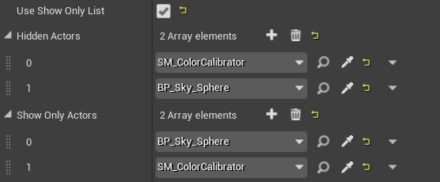
5. In `OBS Studio` (or your `Spout` receiver programme):
    a. Click on your `SPOUT2 Capture` `Source`.
    b. In the pop-up window for `Composite Mode` select `Premultiplied Alpha`.
    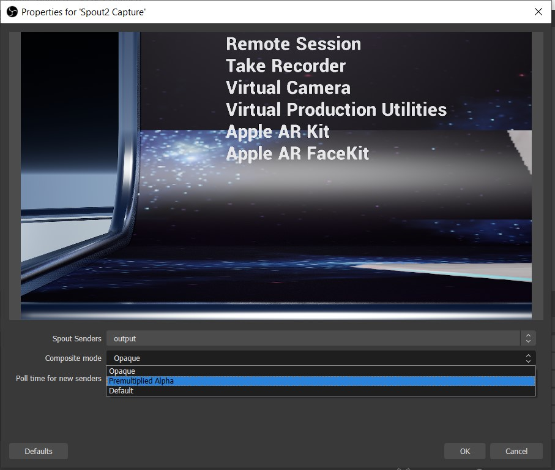
    c. You should now see the `Actors` you have selected in Unreal as an alpha channel in `OBS Studio`/ your `Spout` receiver programme.
    

---
# DLSS & OWL Cinecam

`DLSS` works with the `OWL CineCam` in all game targets (`PIE`, `Standalone`, `Packaged`) but not `in-Editor` (because of the `DLSS` implementation). You can configure it as follows:
=======

>>>>>  gd2md-html alert: inline image link here (to images/image14.png). Store image on your image server and adjust path/filename/extension if necessary.  (<a href="#">Back to top</a>)(<a href="#gdcalert15">Next alert</a>) >>>>> 

Texture Target:

*   You can select the Render Texture Target that you want to attach to the Cinecam using the drop-down as described above.
*   Please use the resolution, clear colour and gamma controls in the Details panel and NOT the separate Render Texture Target window (the latter will crash your level (this is currently being worked on)).

Resolution/ Aspect Ratio:

*   The aspect ratio of the camera can be set using the `Filmback` dropdown lower in the details panel.
*   The aspect ratio automatically changes the `Resolution` configuration at the top of the details panel if the `Constrain Aspect Ratio` tickbox is selected in the `Camera Options` section. If unticked then you can create whatever aspect ratio you like.
*   If the `Constrain Aspect Ratio` tickbox is selected, only the Y value of the resolution can be changed and this will automatically adjust the X value.

Clear Color/ Render Target Gamma

*   This changes the default colour of the render texture so the background color of the alpha channel can be customized (e.g. if you want to send a green screen background for keying in OBS).

Pause Rendering:

*   This enables you to pause rendering on the camera which is useful for saving GPU power when using live-editing.
*   This allows you to stream a static/ paused image if `Pause rendering` is selected in the Cinecam details panel and `Active` is selected in the SPOUT sender manager for that Cinecam.

Use Show Only List/ Show Only Actors:

*   This is used to select specific actors to appear in an alpha channel output, this requires a post-process volume (full guide below).

Hidden Actors:

*   This dropdown can be used to select actors in your scene and stop them from being rendered into your video output, this requires a post-process volume (full guide below).

Max View Distance Override:

*   This can be used to cull distant objects from a reflection.

Standard Cinecam Features:

*   The OWL Cinecam also includes the following standard Cinecam features which can be used to select properties such as aspect ratio and depth of field:
    *   Filmback
    *   Lens Settings
    *   Focus Settings
    *   Focal Length
    *   Aperture
    *   Horizontal Field of View

### Depth of Field

The OWL Cinecam includes all the of the Depth of Field capabilities from the Unreal Cinecam which are split across the `Current Camera Settings` and `Post Process` sections.

*   For more information about Depth of Field [please see the Unreal guidelines here](https://docs.unrealengine.com/en-US/RenderingAndGraphics/PostProcessEffects/DepthOfField/CinematicDOFMethods/index.html)

### Post Processing

The OWL Cinecam uses the viewport rendering pipeline from Unreal and so can take advantage of Temporal Anti-Aliasing, TAA Motion Blue and TAA Upsampling.

*   All of these can be disabled via the tick-boxes in the Cinecam details panel.
*   All other post-process settings are as standard for the Cinecam:

>>>>>  gd2md-html alert: inline image link here (to images/image15.png). Store image on your image server and adjust path/filename/extension if necessary.  (<a href="#">Back to top</a>)(<a href="#gdcalert16">Next alert</a>) >>>>> 

### Alpha Channel Output

You can select specific Actors to show/ hide (but only Actors, not Components or Instance Meshes) using the `Hidden Actors` and `Show Only Actors` arrays as follows:

1. In `Project Settings` in your Editor, find `Enable alpha channel support` in `Engine - Rendering/ Postprocessing` and set it to `AllowThroughTonemapper`.

>>>>>  gd2md-html alert: inline image link here (to images/image16.png). Store image on your image server and adjust path/filename/extension if necessary.  (<a href="#">Back to top</a>)(<a href="#gdcalert17">Next alert</a>) >>>>> 

2. If you don`t have a `Post Process Volume` in your scene then [follow these instructions](https://subscription.packtpub.com/book/game_development/9781784391966/4/ch04lvl1sec24/adding-post-process) to add one. Then:
    1. Select your `Post Process Volume` in `World Outliner`.
    2. In its `Details Panel` go to `Rendering Features`/ `Post Process Materials`/ `Array`. 
    3. Add a new array element and select `Asset reference` from the drop down.
    4. Use the arrow next to the array element you have added to select `M_OwlAlpha`.
    
    

    5.  (If this doesn`t appear in your list, go to `Content Browser`/  `View Options`/ `Show Plugin Content` and then repeat.

>>>>>  gd2md-html alert: inline image link here (to images/image18.png). Store image on your image server and adjust path/filename/extension if necessary.  (<a href="#">Back to top</a>)(<a href="#gdcalert19">Next alert</a>) >>>>> 

3. Click on the OWL Cinecam in the World Outliner and go to its Details panel.
    6. Using the `Hidden Actors` or `Show Only Actors` arrays select the Actors that you would like to show/ hide.
    7. You can do this from the drop down list or using the picker to the left of the drop down list.
    8. If you want to `Show Only Actors` then you need to also tick the `Use Show Only List` tick box.

>>>>>  gd2md-html alert: inline image link here (to images/image19.png). Store image on your image server and adjust path/filename/extension if necessary.  (<a href="#">Back to top</a>)(<a href="#gdcalert20">Next alert</a>) >>>>> 

4. In OBS (or your SPOUT receiver programme):
    9. Click on your SPOUT2 Source.
    10. In the pop-up window for `Composite Mode` select `Premultiplied Alpha`.
    11. You should now see the `Actors` you have selected in Unreal as an alpha channel in OBS/ your SPOUT receiver programme.

>>>>>  gd2md-html alert: inline image link here (to images/image20.png). Store image on your image server and adjust path/filename/extension if necessary.  (<a href="#">Back to top</a>)(<a href="#gdcalert21">Next alert</a>) >>>>> 

## DLSS & OWL Cinecam

DLSS works with the OWL CineCam in all game targets (PIE, Standalone, Packaged) but not in-Editor (because of the DLSS implementation). You can configure it as follows:

>>>>>>> a6cac9f2534ddc26ee6242e96d53acfd36cc7540
1. Ensure that you have the latest NVIDIA GeForce drivers [here](https://www.nvidia.com/drivers)
2. Set up `DLSS` in your level by watching a [tutorial like this](https://www.youtube.com/watch?v=4JkHE48YptA)
3. Use blueprints to set up a toggle for DLSS at runtime such as this: 

---
# Composure
- You can output your `Composure` `Render Target` through the `Spout Sender Manager` as follows:
1. 
---
# Unreal Virtual Camera/ LiveLink
- You can output from your Unreal Virtual Camera through the `Spout Sender Manager` as follows:
1. 
---
# Testing Spout

## Delivering to Spout

The `Spout Sender Manager` converts DX12 textures to DX11 so they are compatible with `Spout`:

-   You can test`Spout`by downloading the demo[ `Spout` sender/ receiver ](https://leadedge.github.io/spout-download.html).
-   [Use the guide here](https://www.itechtics.com/use-specific-gpu/#:~:text=Click%20on%20Graphics%20Settings.,run%20on%20a%20dedicated%20GPU.) to ensure that the programs you are sharing the video texture between are running on the same GPU. 
-   You also need to ensure that the programmes you are sharing between are also in `High Performance` mode if your computer has any performance throttling (this can be common on laptops).

<<<<<<< HEAD
## Delivering to OBS
=======
The plugin can be used to input/ output any SPOUT sender/ receiver and converts DX12 textures to DX11 so they are compatible with SPOUT:

*   To test with SPOUT you can [download the SPOUT sender/receiver here](https://leadedge.github.io/spout-download.html).
*   You need to ensure that whatever programmes you are sharing the video texture with are also running on the same GPU. [You can use the guide here](https://www.itechtics.com/use-specific-gpu/#:~:text=Click%20on%20Graphics%20Settings.,run%20on%20a%20dedicated%20GPU.).
*   You also need to ensure that the programmes you are sharing between are also in `High Performance` mode or something similar, if your computer has any performance throttling (this can be common on laptops).

### Delivering to OBS
>>>>>>> a6cac9f2534ddc26ee6242e96d53acfd36cc7540

First, please [follow the instructions for installing the](https://docs.google.com/document/d/1jPyk8CN7-zeqZnV8f6GvZfuCs2_x1qDbmZRGIL4eI8g) [Spout to OBS plugin](https://docs.google.com/document/d/1jPyk8CN7-zeqZnV8f6GvZfuCs2_x1qDbmZRGIL4eI8g) 

---
# Optimisation 

## GPU Usage Optimisation

## CPU Usage Optimisation

*   In Editor Preferences in Unreal Engine, please ensure that the box below is unticked. 
*   Without this, you may find that your stream slows down when you have OBS rather than Unreal running in the foreground on your computer.

>>>>>  gd2md-html alert: inline image link here (to images/image22.png). Store image on your image server and adjust path/filename/extension if necessary.  (<a href="#">Back to top</a>)(<a href="#gdcalert23">Next alert</a>) >>>>> 

---
# Technical Considerations

## System Requirements

*   Operating System: Windows 8 or later
*   For ray-tracing, RTX (or other compatible cards) are required. Please see more information [here](https://docs.unrealengine.com/en-US/Engine/Rendering/RayTracing/index.html).
*   Your Windows SDK should be updated to the latest version. Please use Visual Studio to check this (it should be at least above version 19XXX)
<<<<<<< HEAD
---
# Copyright
=======

## Copyright
>>>>>>> a6cac9f2534ddc26ee6242e96d53acfd36cc7540

Copyright © 2021 Off World Live Limited. All rights reserved.