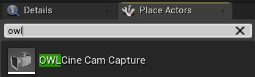
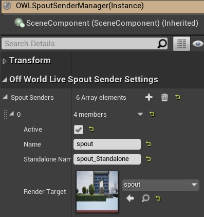

# Unreal Engine: Livestreaming Toolkit

This plugin enables you to send and receive live-stream video to/from `Unreal Engine` to/from [`OBS Studio`](https://github.com/Off-World-Live/obs-spout2-source-plugin) or [other programs](https://spout.zeal.co/) with no computational overhead, compression or latency. 

It works both `in-Editor` and `at Runtime` and is compatible with both `DirectX11` and `DirectX12` (for ray-tracing).
 
It works with `Unreal` tools such as: `Cinecam`, `Composure`, `DLSS`, `Virtual Camera`, `Livelink`, `Metahumans` etc.

For support, [please get in touch on our `Discord` channel.](https://discord.gg/2PaMtnK)

*N.B. This plugin only works for video sharing on a single GPU. For sharing over the network you will need to use a solution like [`NDI`](https://www.ndi.tv/sdk/).*

## Registration
- To download the `Livestreaming Toolkit` you need to `Register`.
- Simply input your email address and you will receive an invitation to download

## Plugin Download

### Unreal Plugin

1. You will receive an email invitation to download the plugin. Click the `Accept Invitation` link and you will be taken to the `Registration`/ `Download` page.

2. You will be asked if you want to accept the plugin invitation.

3. Please accept 

## Plugin Installation

### Add the Plugin to your Unreal Project

1. Ensure that all instances of your `Unreal` project are closed and that you are connected to the internet.
2. If you do not have any `Plugins` installed in your project then create a new `Plugins` folder in your `Project` folder and copy the unzipped plugin inside.

3. If you already have `Plugins` in your project then open the `Plugins` folder to find the `OWLLivestreamingToolkit` folder and copy it into the existing `Plugins` folder in your `Project`.

4. When installed correctly, the folder structure should read `Project`/`Plugins`/`OWLLivestreamingToolkit`.

### Sign in to Off World Live

1. Open your `Unreal` project and you will see an `Off World Live` icon above your `Viewport`. Click it and you will be taken to login.

2. You have an option to sign in with your `Gmail` account or any other email.
 
3. Validate your login and you will be returned to Unreal.

## Toolkit Overview

There are three main components to the toolkit:
1. The `OWL Cinecam` which allows you to output an `Unreal` `Cinecam` to a `Render Target` for use with the `Spout Sender Manager` or as a replacement for `Unreal`'s `Scene Capture 2D` `Actor` (see the benefits of this below).
2. The `Spout Sender Manager` which allows you to live-stream any `Unreal` `Render Target` to `OBS Studio` or any other `Spout` compatible program.
2. The `Spout Receiver Manager` which allows you to receive any real-time video feeds from and `Spout` compatible program in `Unreal`.

## OWL Cinecam

### Overview

- The `OWL Cinecam` is a modified `Unreal` `Cinecam` that combines the best features of the `Unreal` `Ci necam` and `Scene Capture 2D`: 
    - It uses the `Unreal` `Viewport` rendering pipeline which means it will output exactly the same colours as your `Viewport`. 
    - It can be used with rendering optimisations such as `DLSS` and `TAAU`.
    - It benefits from `Cinecam` features such as `Depth of Field`, `Filmback` and `Post Processing`.
    - It  integrates useful `Scene Capture 2D` features like `Alpha` and `Resolution`.
    - It outputs to a `Render Target` and so can be used with our `Spout Sender Manager`to live-stream video.

### Installation
- Please install as follows:
1. Find the `OWLCine Cam Capture` `Actor` in the `Place Actors` panel and drag it into your scene.

2. In `World Outliner`select `OWLCine Cam Capture`so it opens in your `Details` panel.

3. In your `Details` panel, create a `Render Target` to receive the video feed from your `OWL Cinecam` by clicking the dropdown next to `Texture Target` and selecting `Render Target`.
 
4. Name your `Render Target` so that you can select it from the drop down list.
 
5. You will now see your `Render Target` connected to your `OWL Cinecam`
 

## Spout Sender Manager

### Overview

- The `Spout Sender Manager` is an `Unreal` `Actor` that you use to manage different real-time `Spout` video ouputs from `Unreal`. 
- It allows you to output any `Render Target` from `Unreal` to `Spout` (such as those from `OWL Cinecam` or `Composure`)
- It works both `in-Editor` and `at-Runtime` and can be controlled through `Blueprints`.

### Installation
- Please install as follows:

1. Find the `OWLSpoutSenderManager` `Actor` in the `Place Actors`panel and drag it into your scene.

2. In `World Outliner`select `OWLSpoutSenderManager`so it opens in your `Details` panel.

3. In your `Details` panel add a `Spout Sender` `Array Element` and click the arrow in the right hand corner to open the `Array Element` showing its `Members` (there are 4). 

- You need to:
    a.  Name your `Sender` and `Standalone Sender` as this is what your video feeds will be called in `OBS`/ your `Spout` receiver programme.
    b. Select/ create a `Render Target` by clicking the drop down (this can be from your `OWL Cinecam` as configured above or from another `Unreal` output.) 
    c. Click the `Active` box to begin sending to `Spout`.
 
4. To stream multiple cameras, just add additional `Array Elements`.
5. You can control the `Active` tick-box via `Blueprints` to manage which cameras are rendering simultaneously and so reduce computational load.

## Spout Receiver Manager

### Overview

- The `Spout Receiver Manager` is an `Unreal` `Actor` that you use to manage different real-time `Spout` video inputs to `Unreal`. 
- Inputs are managed as `Render Targets` in the same way as the `Spout Sender Manager`
- You need to create a `Material` from your `Render Target` to add the video input to `Actors` in your scene (explained below).
- It works both `in-Editor` and `at-Runtime` and can be controlled through `Blueprints`.

### Installation
- Please install as follows:

1. Find the `OWLSpoutReceiverManager` `Actor` in the `Place Actors`panel and drag it into your scene.  

2. In `World Outliner`select `OWLSpoutReceiverManager`so it opens in your `Details` panel.
3. In your `Details` panel add a `Spout Receiver` `Array Element` and click the arrow in the right hand corner to open the `Array Element` showing its `Members` (there are 3). 

4. To receive your video input/s you need to:
    a. In `Content Browser` add a new `Render Target` by selecting: `Add/Import`> `Materials & Textures` > `Render Target`.

    b. Give your `Render Target` a name so you can identify it from the drop-down list in the `Spout Sender` `Array`
 
    c. Go back to your `Spout Receiver Manager` `Details` panel and select your newly added `Render Target` in your `Spout Receiver` `Array`

    d. Input the name of your `Spout Sender` video-feed. This needs to be **EXACTLY** the same as your `Spout Sender` in your external program otherwise it will not appear.
    e. Click the `Active` box to begin receiving the video-feed from your external `Spout Sender` (you should automatically see your input in the `Render Target` thumbnail.)

5. To add your video input/s to elements in your scene you need to:
    a. Create a `Material` from your `Render Target`: Right click on the `Render Target` you created in `Content Browser` (step 4.a) and choose `Create Material`.

    b. Drag the newly created `Material` (which will be called the same as your `Render Target`) onto the elements in your level.

6. To receive multiple input feeds, just add additional `Array Elements`.
7. You can control the `Active` tick-box via `Blueprints` to manage which cameras are rendering simultaneously and so reduce computational load.

## OWL Cinecam Features

- The `OWL Cinecam` combines features from the `Unreal` `Cinecam` and `Scene Capture 2D` to create a streaming camera that benefits from the features and rendering pipeline of `Cinecam`.

### General Features

#### Render Texture Target:
  
- You can select the `Render Texture Target` that you want to attach to the `OWL Cinecam` using the drop-down as described above in `OWL Cinecam` step 3.
- You can create multiple `Render Texture Targets` and use `Blueprints` to switch between then as required.

#### Resolution/ Aspect Ratio:

- The `OWL Cinecam` has both a `Resolution` and an `Aspect Ratio`.
  
- The `Aspect Ratio` is controlled through the standard `Cinecam` `Filmback` settings in the `Details` panel and changes the size of the `Render Target`.
- The `Resolution` is locked to the `Aspect Ratio` so you can only increase/ decrease the `Y-Value` (which will automatically set the correct proportionate `X-Value`). 
- To disconnect `Resolution` from `Aspect Ratio` you can untick `Constrain Aspect Ratio` in the `Camera Options` section of the `Details` panel. N.B. this will create a distorted output.
 

#### Render Target Clear Color/ Gamma

- The `Render Target` `Gamma` is exposed in the `Details` panel and set to 2.2 as this is the optimal colour setting for streaming.  
- The `Clear Colour` settings can be used to change the default colour of the `Render Texture`  (e.g. if you want to send a green screen background for keying in `OBS Studio`).
 

#### Pause Rendering:

-   This enables you to `Pause Rendering` on the `OWL Cinecam` which is useful for saving GPU power when using live-editing.
-   This will stream a static/ paused image if `Pause Rendering` is selected in the `OWL Cinecam` `Details` panel and `Active` is selected in the `Spout Sender Manager` (for that `OWL Cinecam`). This is useful if you want to see the position of your different cameras but only render a live video-feed from a single camera at a time).
 

#### Use Show Only/ Hidden Actors:

-   `Show Only` is used to select specific `Actors` to appear in an alpha channel output.
-   `Hidden Actors` can be used to select `Actors` in your scene and stop them from being rendered into your output.
-  Both require a post-process volume (see full guide below).
 

#### Max View Distance Override:

-   This can be used to cull distant objects from a reflection.
 

#### Standard Cinecam Features:

-   The `OWL Cinecam` also includes the following standard `Cinecam` features which can be used to select properties such as `Aspect Ratio` and `Depth of Field`:
    -   `Filmback`
    -   `Lens Settings`
    -   `Focus Settings`
    -   `Focal Length`
    -   `Aperture`
    -   `Horizontal Field of View`
    -   `Lookat tracking settings`
    -   `LOD Distance Factor`
 

### Depth of Field

- The `OWL Cinecam` includes all the of the `Depth of Field` capabilities from the `Unreal` `Cinecam` which are split across the `Current Camera Settings` and `Post Process` sections.
- For more information about `Depth of Field` [please see the `Unreal` guidelines here](https://docs.unrealengine.com/en-US/RenderingAndGraphics/PostProcessEffects/DepthOfField/CinematicDOFMethods/index.html)

### Post Processing

The `OWL Cinecam` uses the `Viewport` rendering pipeline from Unreal and so can take advantage of `Temporal Anti-Aliasing`, `TAA Motion Blur` and `TAA Upsampling`.
-   All of these can be disabled via the tick-boxes in the `OWL Cinecam` details panel.
-   All other post-process settings are as standard for the `OWL Cinecam`.

### Alpha Channel Output

You can select specific `Actors` to show/ hide (but only `Actors`, not `Components` or `Instance Meshes`) using the `Hidden Actors` and `Show Only Actors` `Arrays` as follows:

1. Go to `Project Settings` in your `Editor`
 
2. find `Enable alpha channel support` in `Engine - Rendering/ Postprocessing` and set it to `AllowThroughTonemapper` (you will be asked to restart your level).

3. If you don’t have a `Post Process Volume` in your scene then [follow these instructions](https://subscription.packtpub.com/book/game_development/9781784391966/4/ch04lvl1sec24/adding-post-process) to add one. Then:
    a. Select your `Post Process Volume` in `World Outliner`.
    b. In its `Details` panel go to `Rendering Features`/ `Post Process Materials`/ `Array`.
    c. Add a new `Array element` and select `Asset reference` from the drop down.
    d. Search for and select `M_OwlAlpha`.
    
    e. If `M_OwlAlpha` doesn’t appear in your list, go to `Content Browser`>  `View Options`> `Show Plugin Content` and then repeat.
4. Click on the `OWL Cinecam` in the `World Outliner` and go to its `Details` panel.
    a. Using the `Hidden Actors` or `Show Only Actors` arrays select the `Actors` that you would like to show/ hide.
    b. You can do this from the drop down list or using the picker to the left of the drop down list.
    c. If you want to `Show Only Actors` then you need to also tick the `Use Show Only List` tick box.
    
5. In `OBS Studio` (or your `Spout` receiver programme):
    a. Click on your `SPOUT2 Capture` `Source`.
    b. In the pop-up window for `Composite Mode` select `Premultiplied Alpha`.
    
    c. You should now see the `Actors` you have selected in Unreal as an alpha channel in `OBS Studio`/ your `Spout` receiver programme.
    

## DLSS & OWL Cinecam

`DLSS` works with the `OWL CineCam` in all game targets (`PIE`, `Standalone`, `Packaged`) but not `in-Editor` (because of the `DLSS` implementation). You can configure it as follows:
1. Ensure that you have the latest NVIDIA GeForce drivers [here](https://www.nvidia.com/drivers)
2. Set up `DLSS` in your level by watching a [tutorial like this](https://www.youtube.com/watch?v=4JkHE48YptA)
3. Use blueprints to set up a toggle for DLSS at runtime such as this: 

## Composure
- `Composure` is Unreal's native plugin for chromakeying elements in your scene.
- You can output your `Composure` `Render Target` through the `Spout Sender Manager` as follows:
1. Follow the Unreal `Composure` guide [here](https://docs.unrealengine.com/en-US/WorkingWithMedia/Composure/QuickStart/index.html) (or a similar video guide).
2. Once you have created your `Composure` select your `Media Plate` in `World Outliner`and in the `Details` panel go to `Output` section and add a new `Array Element`.

3. In your `Array Element` for `Output Pass` please select `Render Target Compositing Output` from the drop down.

4. Create a new `Render Target` following the instructions as above (in the `OWL Cinecam` section).

5. Name your `Output` and ensure it is `Enabled`

5. Now if you go to your `Spout Sender Manager`you can create a new `Array Element` using your new `Render Target` for your `Composure` output and stream it wherever you like.

## Unreal Virtual Camera
- The Unreal `Virtual Camera`allows you to control your `OWL Cinecam` from an external device such as an `Iphone` via the `ARKit` plugin.
- To do so, you need to attach the `Virtual Camera` `Pawn` to your `OWL Cinecam` then you need to configure your `Virtual Camera` pawn to work with `Live Link` (to be controlled by an external input).
- Guidance for how to setup the `Virtual Camera` can be found [here](https://docs.unrealengine.com/en-US/AnimatingObjects/VirtualCamera/VirtualCameraComponentQuickStart/index.html) and [here](https://docs.unrealengine.com/en-US/AnimatingObjects/VirtualCameraPlugin/index.html) (more details below).
- You can also use the `Unreal` `Virtual Camera Actor`([see instructions here](https://docs.unrealengine.com/en-US/AnimatingObjects/VirtualCamera/VirtualCameraActorQuickStart/index.html)) to output a `Render Target` directly to the `Spout Sender Manager` but this uses the `Scene Capture 2D` rendering pipeline, so the `OWL Cinecam` offers a better image quality.

### Attaching the Virtual Camera to the OWL Cinecam

- The `Virtual Camera` can be connected to the `OWL Cinecam` by using the `Vcam` pawn as follows:
1. Select your `OWL Cinecam` in `World Outliner` and go to its  `Details` panel.

2. In the `Details` panel go to `+Add Component` and in the search box type `Vcam` and select this `Component`.

3. Drag the `Vcam` `Component` on top of your `OWL Cinecam Capture Component` to attach it to your `OWL Cinecam` so that it is nested below.
.
4. Now, when your `Vcam` is configured (see links below), it will operate your `OWL Cinecam` and output video via its `Render Target` to the `Spout Sender Manager`.

### Configuring the Virtual Camera

-  Step-by-step instructions for how to setup the `Vcam` component can be [found here](https://docs.unrealengine.com/en-US/AnimatingObjects/VirtualCamera/VirtualCameraComponentQuickStart/index.html).
- For more information on how to set up `Live Link` to control the `Vcam` with external devices such as your `Iphone` [see the guidance here](https://docs.unrealengine.com/en-US/AnimatingObjects/VirtualCameraPlugin/index.html).

## Troubleshooting Spout

- [`Spout`](https://spout.zeal.co/) is the solution used by the plugin to share video textures between `Unreal` and other programs.
- There will always be a `Spout Sender` which is the program outputting the video and a `Spout Receiver` which is the program receiving the video.
- If your video feed does not automatically appear in your desired program it is normally because either `Sender` or `Receiver` has an issue.
- You can troubleshoot `Spout` using the tips below:
1. Download the demo `Spout` sender/ receiver [here](https://leadedge.github.io/spout-download.html) to see whether it is the `Sender` program or the `Receiver` program that is not working with `Spout`.
2. Ensure that `Unreal` and your other program are running on the same `GPU` (this is an issue with some laptops). To deal with this:
    a. Check `Windows` `Task Manager` to see which `GPU` your programs are running on - [guide here](https://www.digitalcitizen.life/7-ways-launch-task-manager-windows-8/)
    b. [Use the guide here](https://www.itechtics.com/use-specific-gpu/#:~:text=Click%20on%20Graphics%20Settings.,run%20on%20a%20dedicated%20GPU.) to force your program to use a specific GPU.
3.  Ensure that the programmes you are sharing between are also in `High Performance` mode if your computer has any performance throttling (this can be common on laptops).
4. For any other issues [contact us on `Discord`](https://discord.gg/2PaMtnK)

## SPOUT Plugin for OBS

In order to stream the output from `Unreal Engine` to the Internet:

1. [Install `OBS Studio`](https://obsproject.com/download)
2. Install our [`Spout2 Source Plugin for OBS Studio (64bit)`.](https://github.com/Off-World-Live/obs-spout2-source-plugin/releases) 
3. See [installation guide here](https://docs.google.com/document/d/1jPyk8CN7-zeqZnV8f6GvZfuCs2_x1qDbmZRGIL4eI8g)

## Performance Optimisation 

### GPU Usage Optimisation
- Each `Active` `Render Target` creates a new video feed that has to be rendered from `Unreal` and so uses a lot of GPU power.
- Since `Spout` is zero-latency, a number of tricks can be used for live-editing between different cameras in a seamless way (all of these can be configured via `Blueprints` for control via `OSC` or external devices):
1. Use the `Pause` tickbox on the `OWL Cinecam` for any static camera that you want to see the location of (for live-editing) but you don't need to have running until you select it as your main camera.
2. Use the `Active` tickbox on the `Spout Sender Manager` and `Spout Receiver Manager` to only deliver the video feed from the `Render Target` when you need it (`Paused` and `Active` will show a static image as above).
3.  Use `Blueprints` to output a reduced `Resolution` for any moving camera that you need to see output from and then automatically increase the `Resolution` to your broadcast requirements when it is selected as your main camera.
4.  Use a single `OWL Cinecam` but place `Waypoints` in your scene of your different camera angles and then use `Blueprints` to 'teleport' your camera between those different locations live.

### CPU Usage Optimisation

- You may find that your stream slows down when you have OBS rather than Unreal running in the foreground on your computer.   
- To avoid this, in `Editor Preferences` in `Unreal`, please ensure that the `Use Less CPU when in Background` box below is unticked as in the image below:
 

## Technical Considerations

### System Requirements

*   Operating System: `Windows` 8 or later
*   For ray-tracing, `RTX` (or other compatible cards) are required. Please see more information [here](https://docs.unrealengine.com/en-US/Engine/Rendering/RayTracing/index.html).
*   Your `Windows` SDK should be updated to the latest version. Please use `Visual Studio` to check this (it should be at least above version 19XXX)

## Copyright

Copyright © 2021 Off World Live Limited. All rights reserved.