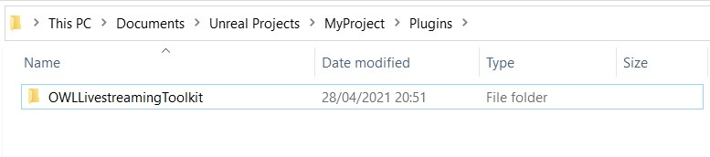
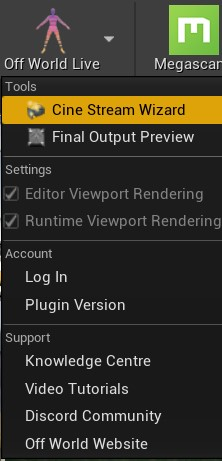
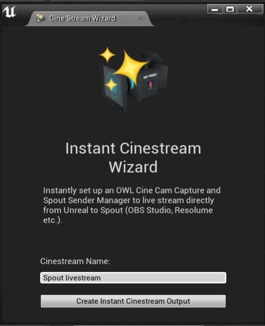

# Unreal Engine: Livestreaming Toolkit

>This plugin is currently in private beta. Please request access [here.](https://forms.clickup.com/f/2cqrr-1331/HMMLTQJM1Q9KSTQ9T0) For support, [please get in touch on our Discord channel.](https://discord.gg/2PaMtnK)

This plugin enables you to send and receive video to/from [Unreal Engine](https://www.unrealengine.com/) to/from [Spout programs](https://spout.zeal.co/) (including [OBS Studio](https://github.com/Off-World-Live/obs-spout2-source-plugin)) with no computational overhead, compression or latency. 

*N.B. This plugin only works for video sharing on a single GPU. For sharing over the network you will need to use [`Spout to NDI`](https://leadedge.github.io/) to convert your `Spout` output into an `NDI` feed.*

## Summary
The toolkit works both `in-Editor` and `at Runtime` and is compatible with both `DirectX11` and `DirectX12` (for ray-tracing). It has four main components (more details below):
1. The `OWL Cinecam` which is an Unreal `Cinecam` which outputs direct to a `Render Target` and includes alpha output, HUD/Burn-In, DLSS and various other additional capabilities.
2. The `OWL Capture` component which can be attached to any Unreal Camera or Cinecam to deliver the same output and capabilities as the `OWL Cinecam`.
3. The `Spout Sender Manager` which allows you to output any Unreal `Render Target` to [`Spout`](https://spout.zeal.co/) (including from `Composure` and Unreal's `Virtual Camera`).
4. The `Spout Receiver Manager` which allows you to input any [`Spout`](https://spout.zeal.co/) video feed into Unreal as a `Render Target` including to `Composure` or as a `Material` etc.

## Unreal Plugin Download and Setup

### Request Access
Please request access to the beta [here](https://forms.clickup.com/f/2cqrr-1331/HMMLTQJM1Q9KSTQ9T0)

### Registration/ Download

1. You will receive an email invitation to download the plugin. Click the `Accept Invitation` link and you will be taken to the Registration/Download page.

2. Please accept the invitation to be taken to the Registration page.

3. Please register your email and select your preferences for marketing and Telemetry.

4. Once you have registered, you will be taken to the download page.
 

### Installation

#### Add the Plugin to your Unreal Project

1. Ensure that all instances of your Unreal project are closed and that you are connected to the internet.
2. If you do not have any plugins installed in your project then create a new `Plugins` folder in your Project folder and copy the unzipped plugin inside.

3. If you already have `Plugins` in your project then open the `Plugins` folder to find the `OWLLivestreamingToolkit` folder and copy it into the existing `Plugins` folder in your Project.

4. When installed correctly, the folder structure should read `Project/Plugins/OWLLivestreamingToolkit`.

#### Sign in to Off World Live

1. When you open your Unreal project, you will be prompted to login:

2. Alternatively, if you want to login later, you can do so through the Editor icon:   

2. Login with the details you used sign in to the Downloads page.
 
3. Validate your login and you will be returned to Unreal.

## Toolkit Overview and Setup

There are four main components to the toolkit:
1. The `OWL Cinecam` which is an Unreal `Cinecam` which outputs direct to a `Render Target` and includes alpha output, HUD/Burn-In, DLSS and various other additional capabilities.
2. The `OWL Capture` component which can be attached to any Unreal Camera or Cinecam to deliver the same output and capabilities as the `OWL Cinecam`.
3. The `Spout Sender Manager` which allows you to output any Unreal `Render Target` to [`Spout`](https://spout.zeal.co/) (including from `Composure` and Unreal's `Virtual Camera`).
4. The `Spout Receiver Manager` which allows you to input any [`Spout`](https://spout.zeal.co/) video feed into Unreal as a `Render Target` including to `Composure` or as a `Material` etc.

## OWL Cinecam

### Overview

The `OWL Cinecam` has all the features of the Unreal Cinecam plus many additional capabilities: 
1. It uses the Unreal `Viewport` rendering pipeline which has more capabilties than `Scene Capture 2D`.
2. It can be used with rendering optimisations such as [DLSS](unrealengine.com/marketplace/en-US/product/nvidia-dlss) and [TAAU](https://docs.unrealengine.com/4.26/en-US/RenderingAndGraphics/ScreenPercentage/).
3. It benefits from `Cinecam` features such as `Depth of Field`, `Filmback` and `Look At Tracking`.
4. It  integrates features like `Alpha` (`Show Only` and `Hide Only`) and exposed `Rendering Flags`.
5. It has the option for a customisable `UMG` for `HUDs`/ `Burn-Ins`.
6. It has a `Pause Rendering` capability for performance optimisation.
7. It outputs to a `Render Target` and so can be used with our `Spout Sender Manager`to live-stream video.

### Instant Live-stream Wizard

You can select the `OWL Cinecam Stream Wizard` to instantly create an `OWL Cinecam` which live-streams from Unreal:
1. In the Editor Toolbar click on the Off World Live logo and select `OWL Cinecam Stream Wizard`.   

2. In the pop-up that appears, give a name to your stream.

3. Add another or exit the window.

4. Now you have automatically created an `OWL Cinecam` with it's own `Render Target`.
 
and a `Spout Sender Manager` which is sending the `Render Target` to Spout.
 
5. If you want to modify the details of those two actors, you can select them in the `World Outliner` panel and change their features as outlined below:
 

### Add from Place Actors
 
1. Find the `OWLCinecam Capture` Actor in the `Place Actors` panel and drag it into your scene.

2. In `World Outliner`select `OWLCine Cam Capture`so it opens in your `Details` panel and create a `Render Target` by clicking the dropdown next to `Texture Target` and selecting `Render Target`.
 
4. Name your Render Target so that you can select it from the drop down list.
 
5. You will now see your Render Target connected to your `OWL Cinecam`.
 

## OWL Capture Component

### Overview
- The `OWL Capture Component` can be added to any Unreal Cinecam or Camera to instantly capture its content to a `Render Target` (for live-streaming via the `Spout Sender Manager`).
- It contains all the augmented features of the `OWL Cinecam Capture` as outlined above/below.

### Configuration
1. Select the Camera or Cinecam you want from the `World Outliner`, go to the `Details` panel, click `Add Component` and search for and select the `OWL Capture` component.

2. Drag the `OWL Capture` component onto the `Camera Component` to attach it.

3. You now can use the `OWL Capture` settings in your `Details` panel to capture to a `Render Target`and modify settings.

## Spout Sender Manager

### Overview

- The `Spout Sender Manager` is an Unreal Actor that you use to manage different real-time `Spout` video ouputs from Unreal. 
- It allows you to output any Render Target from Unreal to `Spout` (such as those from `OWL Cinecam` or _Composure_)
- It works both `in-Editor` and `at-Runtime` and can be controlled through `Blueprints`.

### Configuration

1. Find the `OWLSpoutSenderManager` Actor in the `Place Actors`panel and drag it into your scene.

2. In `World Outliner` select `OWLSpoutSenderManager` so it opens in your `Details` panel, add a `Spout Sender` `Array Element` and click the arrow in the right hand corner to open the `Array Element` showing its Members (there are 4). 

3. Select/ create a `Render Target` by clicking the drop down (this can be from your `OWL Cinecam` as configured above or from another Unreal output.) 
4. Name your `Sender` and `Standalone Sender` as this is what your video feeds will be called in `OBS`/ your `Spout` receiver programme.
5. Click the `Active` box to begin sending to `Spout`.
6. To stream multiple cameras, just add additional `Array Elements`.
7. You can control the `Active` tick-box via `Blueprints` to manage which cameras are streaming from Unreal at any one time.

## Spout Receiver Manager

### Overview

- The `Spout Receiver Manager` is an Unreal Actor that you use to manage different real-time `Spout` video inputs to Unreal. 
- Inputs are managed as `Render Targets` in the same way as the `Spout Sender Manager`
- You need to create a `Material` from your `Render Target` to add the video input to `Actors` in your scene (explained below).
- It works both `in-Editor` and `at-Runtime` and can be controlled through `Blueprints`.

### Configuration

1. Find the `OWLSpoutReceiverManager` Actor in the `Place Actors` panel and drag it into your scene.  

2. In `World Outliner` select `OWLSpoutReceiverManager` so it opens in your `Details` panel, add a `Spout Receiver` `Array Element` and click the arrow in the right hand corner to open the `Array Element` showing its Members (there are 3). 

3. Create a `Render Target` and give it a name.
4. Select a `Spout` input feed from the list of options in the `Name` dropdown (any active Spout source will show).
5. Click `Active` to start capturing the `Spout` source to your `Render Target`.
6. To receive multiple input feeds, just add additional `Array Elements`.
7. You can control the `Active` tick-box via `Blueprints` to manage which cameras are rendering simultaneously and so reduce computational load.
8. To add your `Spout` video feed to your level, just drag-and-drop your `Render Target`from your `Content Browser` to any asset in your scene.

## OWL Cinecam

- The `OWL Cinecam` is a live-streaming camera that benefits from the features and rendering pipeline of `Cinecam`.
- It also contains a variety of augmented features vs. the Unreal `Cinecam` such as Alpha output, UMG Rendering for HUD/ Burn-Ins, DLSS capability and exposed Render Flags.

### Render Target Output
  
- You can select the `Render Target` to capture the `OWL Cinecam`.
- You can create multiple `Render Targets` and use `Blueprints` to switch between then as required.

### Custom Resolution

- You can adjust the resolution of your Render Target by changing the Y value. This will automatically adjust the X value to match your `Filmback` settings from the `Current Camera Settings` section.
  
- To disconnect `Resolution` from `Aspect Ratio` you can untick `Constrain Aspect Ratio` in the `Camera Options` section of the `Details` panel. N.B. this will create a distorted output.
 

### Render Target Gamma

- The Render Target `Gamma` is exposed in the `Details` panel and set to 2.2 which ensures that your streamed output matches the colors of your Unreal `Viewport`.
 

### Pause Rendering

-   This enables you to `Pause Rendering` on the `OWL Cinecam` which is useful for saving GPU power when using live-editing.
-   If `Pause Rendering` is selected in the `OWL Cinecam` `Details` panel and `Active` is selected in the `Spout Sender Manager` you will continue to stream a static image of the last frame. 
- This is useful if you want to see the position of your different cameras but only render a live video-feed from a single camera at a time.
 

### UMG Rendering

- This enables you to add a UMG to the `Render Target` of your camera which you can use for a Heads Up Display (HUD) or custom Burn-In.
- You can create any UMG as a [Blueprint Widget](https://docs.unrealengine.com/4.26/en-US/InteractiveExperiences/UMG/HowTo/CreatingWidgets/) and then add it via the drop-down.
- The `Render HUD` option allows you to toggle the UMG on/ off which can be controlled from blueprints.
 

### Use Show Only/ Hidden Actors

-   `Show Only` is used to select specific `Actors` to appear in an alpha channel output.
-   `Hidden Actors` can be used to select `Actors` in your scene and stop them from being rendered into your output.
 

### Max View Distance Override

-   This can be used to cull distant objects from a reflection.
 

### LOD Distance Factor
- This can be used to scale the distance used by LOD.
 

### Rendering Flags

- You can select and de-select all `Rendering Flags` to achieve custom render passes.
 
- Any unticked flag will omit that render pass from your final output.
 

## Alpha Channel Output

You can select specific `Actors` to show/ hide (but only `Actors`, not `Components` or `Instance Meshes`) using the `Hidden Actors` and `Show Only Actors` `Arrays` as follows:

1. Go to `Project Settings` in your `Editor`
 
2. find `Enable alpha channel support` in `Engine - Rendering/ Postprocessing` and set it to `AllowThroughTonemapper` (you will be asked to restart your level).

4. Click on the `OWL Cinecam` in the `World Outliner` and go to its `Details` panel.
    1. Using the `Hidden Actors` or `Show Only Actors` arrays select the `Actors` that you would like to show/ hide.
    2. You can do this from the drop down list or using the picker to the left of the drop down list.
    3. If you want to `Show Only Actors` then you need to also tick the `Use Show Only List` tick box.
    
5. In `OBS Studio` (or your `Spout` receiver programme):
    1. Click on your `SPOUT2 Capture` `Source`.
    2. In the pop-up window for `Composite Mode` select `Premultiplied Alpha`.
    
    3. You should now see the `Actors` you have selected in Unreal as an alpha channel in `OBS Studio`/ your `Spout` receiver programme.
    

## DLSS & OWL Cinecam

- **DLSS** works with the `OWL CineCam` in all game targets (`PIE`, `Standalone`, `Packaged`) but not `in-Editor` (because of the **DLSS** implementation). 
- You can setup **DLSS** as follows:
    1. Ensure that you have the latest NVIDIA GeForce drivers [here](https://www.nvidia.com/drivers)
    2. Set up **DLSS** in your level by watching a [tutorial like this](https://www.youtube.com/watch?v=4JkHE48YptA)
    3. Use blueprints to set up a toggle for DLSS at runtime such as this: 
    

## Composure

### Composure Spout Output
Composure is Unreal's native plugin for chromakeying elements in your scene.
- You can output your Composure `Render Target` through the `Spout Sender Manager` as follows:
1. Follow the [Unreal Composure guide here](https://docs.unrealengine.com/en-US/WorkingWithMedia/Composure/QuickStart/index.html) (or a similar video guide).
2. Once you have created your Composure actor, select your `comp` in `World Outliner`and in the `Details` panel go to `Output` and add a new `Array Element`.

3. In your `Array Element` for `Output Pass` please select `Render Target Compositing Output` from the drop down.

4. Create a new `Render Target` following the instructions as above (in the `OWL Cinecam` section). Name your `Output` and ensure it is `Enabled`

5. Now if you go to your `Spout Sender Manager` you can create a new `Array Element` using your new Render Target for your `Composure` output and stream it wherever you like.

### Composure Spout Input
- You can also input live-video to `Composure` using `Spout`, which helps if you want to route capture cards that are unrecognised by Unreal through `OBS Studio`.
- Because `Spout` is zero-latency/ compression you won't lose video quality or frames.

1. Follow the [Unreal Composure guide here](https://docs.unrealengine.com/en-US/WorkingWithMedia/Composure/QuickStart/index.html) (or a similar video guide) to create your comp.
2. Create a your video input using the `Spout Receiver Manager` as described above so that it is streaming into Unreal as a `Render Target`.
3. Go to 'World Outliner' select the `media plate` from your `comp` and go to its `Details` panel.

4. In the `Details` panel got to `Composure` and add a new `Input` using the `Array element` and select `Texture Input`:

5. In the `Texture Input` drop-down, select the `Render Target` you added in step 2 above from the `Search Assets` list:

6. Your Spout input video will now be streaming into your comp!

## Unreal Virtual Camera
- The Unreal `Virtual Camera` allows control from external device such as an `iPad` via the `Unreal Remote 2` [iOS app](https://apps.apple.com/us/app/unreal-remote-2/id1374517532).
- For more information on how to set up `Live Link` to control the `Vcam` with external devices such as your `iPad` [see the guidance here](https://docs.unrealengine.com/en-US/AnimatingObjects/VirtualCameraPlugin/index.html).
- There are currently two ways to use the `Virtual Camera` with the `Livestreaming Toolkit`:

### Virtual Camera Actor
- You can output from the Unreal [`Virtual Camera Actor`](https://docs.unrealengine.com/en-US/AnimatingObjects/VirtualCamera/VirtualCameraActorQuickStart/index.html) via a `Render Target` to the `Spout Sender Manager` as below.
- Please see notes at the bottom if you are using a `UMG Overlay` on your `Virtual Camera` screen.
    1. Select `Virtual Camera Actor`in `World Outliner`and go to the `Details` panel.
    2. Select the `SceneCaptureComponent` from the list of components, go to `Scene Capture` and create a `Render Target`.
    
    4. Ensure that the `Capture Every Frame` tickbox is selected (otherwise the video feed will not update as you move your external device).
    
    5. You can now select this `Render Target` in your `Spout Sender Manager` (as described above).

    #### UMG Overlay
- There are three options for using `UMG Overlay` while streaming output from the `Virtual Camera Actor`, one showing the overlay on your streamed output:. 
    1. To show the `UMG Overlay` in your streamed output you need to:
    - Go to `SceneCaptureComponent`>`Details`>`Scene Capture`>`Capture Source` and select any of the `Final Color` options.
    
    - This will also allow you to adjust the `Gamma` of your `Render Target` which is required to make your `Spout` output match the colours of your `Viewport`.
    - To do so, double click on the thumbnail of your `Render Target` to open it's settings window.
    - In the `Details` panel of the pop-up window, change the `Target Gamma` to '2.2'
    
    2. To not show the `UMG Overlay` in your streamed output but show it in your external controller you need to: 
    - Go to `SceneCaptureComponent`>`Details`>`Scene Capture`>`Capture Source`and select any of the `Scene Color` options.
    
    - However, because the `UMG Overlay` is applied in post-processing, any color modifications to your `Render Target` get blocked so your output will have a `Gamma` of -'2.2' versus what you see in your `Viewport`.
    - You will therefore need to color-adjust the output in your `Spout` Receiver program.
    3. To not show the `UMG Overlay` at all, just set `UMG Overlay` to `None` by:
    - Selecting the `VCam` component in `Virtual Camera Actor`> `Details` panel 
    -  Change the selection in `Virtual Camera`>`Output Providers` array > `Output`>`UMG Overlay` to 'None':
    
    - This will also allow you to change the `Gamma` color settings of your `Render Target` as described in option 1 above to ensure a color match between your `Viewport` and your output.

### OWL Cinecam
- You can attach the [`Virtual Camera Component`](https://docs.unrealengine.com/en-US/AnimatingObjects/VirtualCamera/VirtualCameraComponentQuickStart/index.html) to your `OWL Cinecam` as below.
    1. Select your `OWL Cinecam` in `World Outliner` and go to its `Details` panel.

    2. In the `Details` panel go to `+Add Component` and in the search box type `Vcam` and select this `Component`.

    3. Drag the `Vcam` `Component` on top of your `OWL Cinecam Capture Component` to attach it to your `OWL Cinecam` so that it is nested below.

    4. Now, when your `Vcam` is configured, it will operate your `OWL Cinecam` and output video via its `Render Target` to the `Spout Sender Manager`.

#### UMG Overlay
- The benefit of using the `OWL Cinecam` is that the output video will automatically match the colors you see in your `Viewport`.
- However, currently there is no way to remove the `UMG Overlay` and so it will appear in your streamed video feed.
- If you don't need the `UMG Overlay` in your external controller then you can select `None` in `Virtual Camera`>`Output Providers`>`Output`>`UMG Overlay` to get rid of it all together.

- If you need the `UMG Overlay` but don't want it to appear in your streamed output then please us the `Virtual Camera Actor` as described above.

## Performance Optimisation 

### GPU Usage Optimisation

#### Overview
- Each `Active` `Render Target` creates a new video feed that has to be rendered from Unreal and so uses additional GPU power.
- In addition, if you are using the main Unreal `Viewport` as well this will also be rendering the scene and so competing for GPU resources.
- There are a number of ways to manage this depending on your needs.

#### Disable Viewport Rendering

- You can disable Unreal `Viewport` rendering both in-Editor and at-Runtime by using the toggle boxes in the Off World Live Editor drop-down.
- The performance gain this creates will depend on the resolution of your screen and the screen percentage setting you have in your `Viewport` settings.   

#### Reduce Viewport Rendering
1. Turn on DLSS (this is the highest performance option). See instructions above.
2. Reduce your `Viewport`>`Screen Percentage` to 50%:

3. Set your `Viewport`>`View Mode` to `Brush Wireframe`:

#### Standalone Mode
- If you don't need access to the `Editor` controls then you can run your level in `Standalone Mode` which means that the main `Viewport` won't be rendering.

#### Live Editing
- Since `Spout` is zero-latency, a number of tricks can be used for live-editing between different cameras in a seamless way (all of these can be configured via `Blueprints` for control via `OSC` or external devices):
    1. Use the `Pause` tickbox on the `OWL Cinecam` for any static camera that you want to see the location of (for live-editing) but you don't need to have running until you select it as your main camera.
    2. Use the `Active` tickbox on the `Spout Sender Manager` and `Spout Receiver Manager` to only deliver the video feed from the Render Target when you need it (`Paused` and `Active` will show a static image as above).
    3.  Use `Blueprints` to output a reduced `Resolution` for any moving camera that you need to see output from and then automatically increase the `Resolution` to your broadcast requirements when it is selected as your main camera.
    4.  Use a single `OWL Cinecam` but place `Waypoints` in your scene of your different camera angles and then use `Blueprints` to 'teleport' your camera between those different locations live.

### CPU Usage Optimisation

- You may find that your stream slows down when you have OBS rather than Unreal running in the foreground on your computer.   
- To avoid this, in `Editor Preferences` in Unreal, please ensure that the `Use Less CPU when in Background` box below is unticked as in the image below:
 

## Troubleshooting Spout

- [`Spout`](https://spout.zeal.co/) is the solution used by the plugin to share video textures between Unreal and other programs.
- There will always be a `Spout Sender` which is the program outputting the video and a `Spout Receiver` which is the program receiving the video.
- If your video feed does not automatically appear in your desired program it is normally because either `Sender` or `Receiver` has an issue.
- You can troubleshoot `Spout` using the tips below:
    1. Download the demo `Spout` sender/ receiver [here](https://leadedge.github.io/spout-download.html) to see whether it is the `Sender` program or the `Receiver` program that is not working with `Spout`.
    2. Ensure that Unreal and your other program are running on the same `GPU` (this is an issue with some laptops). To deal with this:
    3. Check `Windows` `Task Manager` to see which `GPU` your programs are running on - [guide here](https://www.digitalcitizen.life/7-ways-launch-task-manager-windows-8/)
    4. [Use the guide here](https://www.itechtics.com/use-specific-gpu/#:~:text=Click%20on%20Graphics%20Settings.,run%20on%20a%20dedicated%20GPU.) to force your program to use a specific GPU.
    5.  Ensure that the programmes you are sharing between are also in `High Performance` mode if your computer has any performance throttling (this can be common on laptops).
    6. For outputs to `OBS` on certain laptops you may also need to change your `OBS` settings [here.](https://obsproject.com/wiki/Laptop-Troubleshooting)
    7. For any other issues [contact us on `Discord`.](https://discord.gg/2PaMtnK)

## SPOUT Plugin for OBS

In order to stream the output from [Unreal Engine](https://www.unrealengine.com/) to the Internet:

1. [Install `OBS Studio`](https://obsproject.com/download)
2. Install our [`Spout2 Source Plugin for OBS Studio (64bit)`.](https://github.com/Off-World-Live/obs-spout2-source-plugin/releases) 
3. See [installation guide here](http://docs.offworld.live/#/obs-spout-plugin/README)

## Technical Considerations

### System Requirements

-   Operating System: `Windows` 10 or later
-   For ray-tracing, `RTX` (or other compatible cards) are required. Please see more information [here](https://docs.unrealengine.com/en-US/Engine/Rendering/RayTracing/index.html).
-   Your `Windows` SDK should be updated to the latest version. Please use `Visual Studio` to check this (it should be at least above version 19XXX)

### Upload Speeds/ Resolutions

- For live-streaming we recommend the following upload speeds (and associated `bitrate` in `OBS Studio`):

    | Resolution | Minimum Upload Speed |
    | ---| ---- |
    |1080 |+7.5 mpbs |
    |2K |+15 mpbs |
    |4K |+30 mpbs |

## Copyright

Copyright © 2021 Off World Live Limited. All rights reserved.