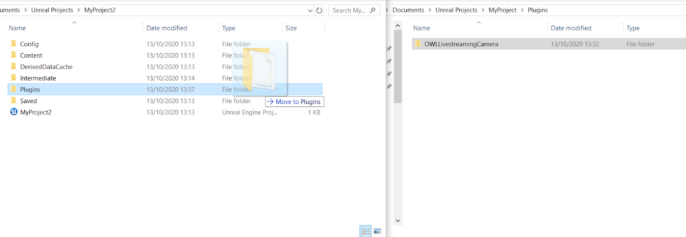

# Unreal LiveStreaming Camera

This plugin enables you to live-stream a video output from Unreal Engine `at Runtime`to [`OBS Studio`](https://github.com/Off-World-Live/obs-spout2-source-plugin) or [other programs](https://spout.zeal.co/) with no computational overhead, compression or latency. 

The plugin is compatible with `DirectX11` and `DirectX12` `APIs` and so can be used for streaming `Ray-Traced` scenes.

Video tutorials for using the camera`s various special features can be found [here](https://www.youtube.com/playlist?list=PLElT6SIg9JnBal5zWDEAVo_l-5TaEhD2J)

For support, [please get in touch on our `Discord` channel.](https://discord.gg/2PaMtnK)

## Installation

### Download the Plugin:

1. If via a file download link download and unzip the downloaded plugin.
2. If via the `Unreal Marketplace`, select the project for the plugin and it will automatically appear in your `Plugins` folder.

### Adding the Plugin to your Unreal Project

1. Ensure that all instances of your Unreal Project are closed.
2. If you do not have any `Plugins` installed in your project then create a new `Plugins` folder in your Project folder and copy the unzipped plugin inside.

3. If you already have `Plugins` in your project then copy-paste the `OWL_LivestreamingCamera` folder into your existing `Plugins` folder.

4. When installed correctly, the folder structure should read `Myproject`/`Plugins`/`OWL_LivestreamingCamera`.

## Camera Setup

1. Open your Project and in the `Place Actors` window, search for `OWLLivestreamingCamera` drop it into your Unreal scene.

2. `At Runtime` (when you press `Play`) the camera will automatically start streaming to `Spout`.

3. You can add as many `OWL Cameras` to your scene as you like. Performance will be relative to your graphics card capacity and output resolution.

## Camera Properties

### Camera Name

-   You can set each camera name as you would like it to appear as a source in output programmes (OBS/ Spout etc).

-   Multiple cameras each must be named differently to ensure separation in output programmes (`OBS`/ `Spout` etc).

### Camera Enabled

- You can `Enable/ Disable` your camera using the tickbox.
- This saves `GPU` power if you need to live-edit between multiple cameras.
- There is a tutorial guide for setting this up [here.](https://www.youtube.com/watch?v=_4_hVYc0HRw)

### Resolution

- `Resolution` can be selected in the camera details panel. 

- Default available `resolutions` are:
    | Resolution | 16:9 |
    | -----------|------|
    | 240p |  426x240 |
    | 360p |  640x360 |
    | 480p | 854x480 |
    | 720p | 1280x720 |
    | 1080p | 1920x1080 |
    | 2k | 2560x1440 |
    | 4k | 3840x2160 |
- You can also set a `Custom Resolution` by ticking `Use Custom Stream Resolution` and inputting it into the boxes below:

## Alpha Channel Output

- You can use the `OWL Camera` to output an `Alpha Channel`.
- A tutorial on this can be found [here](https://www.youtube.com/watch?v=RtiiQR5GIxw&lc=UgwF6h4RMSI8hQn5O2p4AaABAg).
- N.B. You can only select `Actors` to appear in the `alpha channel`. This method does not work with `Components` or `Instance Meshes`.
- To set it up:

    1. In `Project Settings` in your Editor, find `Enable alpha channel support` in `Engine - Rendering/ Postprocessing` and set it to `AllowThroughTonemapper`.
    
2. Select your `OWLLivestreamingCamera` in `World Outliner` and in it's `Details` panel find the section called `Scene Capture` and:
    1. Set `Consider Unrendered Opaque Pixel as Fully Translucent` to `True`
    2. Set `Primitive Render Mode` to `Use ShowOnly List`
    3. Go to the `Show Only Actors` list and create an `array element` for each Actor you want to send in your `alpha channel` (you can select these either from the drop down list or using the colour picker in your Viewport).
    
3. If you don't have a `Post Process Volume` in your scene then [follow these instructions](https://subscription.packtpub.com/book/game_development/9781784391966/4/ch04lvl1sec24/adding-post-process) to add one. Then:
    1. Select your `Post Process Volume` in `World Outliner`.
    2. In its `Details Panel` go to `Rendering Features`>`Post Process Materials`> `Array`. 
    3. Add a new `array element` and select `Asset reference` from the drop down.
    4. Use the arrow next to the array element you have added to select `M_OwlAlpha`.
    
    5.  (If this doesn't appear in your list, go to `Content Browser`> `View Options`>`Show Plugin Content` and then repeat.
    
4. In OBS (or your SPOUT receiver programme) (for a guide on how to stream to OBS more generally please see below):
    1. Click on your SPOUT2 Source.
    2. In the pop-up window for `Composite Mode` select `Premultiplied Alpha`.
    3. You should now see the `Actors` you have selected in Unreal as an alpha channel in OBS/ your SPOUT receiver programme.
    

## Unreal Spout Receiver

- The `Spout Receiver` will allow you to input live video feeds from other `Spout` programs to Unreal
- You can watch a setup video [here](https://www.youtube.com/watch?v=eRuxlOgTN9E).
- To setup please:
1. Open your Unreal Project and, in the `Place Actors` window, search for the `OWLSpout Receiver` Actor and drag and drop the Actor into your scene (you can add multiple if you need).

2. Create a `Render Target` to receive the `Spout` input:
    1. In Content Browser add a new Render Target by selecting: `Add/Import`>`Materials & Textures`>`Render Target`.
    2. Give your Render Target a name.
    
3. Select your `Spout Receiver` in `World Outliner` and in the `Details panel` go to `Off World Live SPOUT Receiver Settings` and:
    1. Click `Receiver Active` to `True`
    2. Select your newly created Render Target from step 2.1 from the drop-down list.
    3. Input the **EXACT** name of your `Spout` sender (as it is called in your external programme) into the `Receiver Name` field. (If the name is not the same the video feed won't appear).
    
5. Create a `Material` from your Render Target and add it toelements in your level:
    1. Right click on your `Spout` Render Target in `Content Browser` (which you previously created above) and choose `Create Material`.
    
    2. Drag the newly created `Material` (which will be called the same as your Render Target) onto the element/s in your level on which you would like to show your video texture.
    

## Performance Optimisation 

### GPU Usage Optimisation
- Each `Active` Render Target creates a new video feed that has to be rendered from Unreal and so uses a lot of GPU power.
- Since `Spout` is zero-latency, a number of tricks can be used for live-editing between different cameras in a seamless way (all of these can be configured via `Blueprints` for control via `OSC` or external devices):
    1. Use the `Pause` tickbox on the `OWL Cinecam` for any static camera that you want to see the location of (for live-editing) but you don't need to have running until you select it as your main camera.
    2. Use the `Active` tickbox on the `Spout Sender Manager` and `Spout Receiver Manager` to only deliver the video feed from the Render Target when you need it (`Paused` and `Active` will show a static image as above).
    3.  Use `Blueprints` to output a reduced `Resolution` for any moving camera that you need to see output from and then automatically increase the `Resolution` to your broadcast requirements when it is selected as your main camera.
    4.  Use a single `OWL Cinecam` but place `Waypoints` in your scene of your different camera angles and then use `Blueprints` to 'teleport' your camera between those different locations live.

### CPU Usage Optimisation

- You may find that your stream slows down when you have OBS rather than Unreal running in the foreground on your computer.   
- To avoid this, in `Editor Preferences` in Unreal, please ensure that the `Use Less CPU when in Background` box below is unticked as in the image below:
 

## Troubleshooting Spout

- [`Spout`](https://spout.zeal.co/) is the solution used by the plugin to share video textures between Unreal and other programs.
- There will always be a `Spout Sender` which is the program outputting the video and a `Spout Receiver` which is the program receiving the video.
- If your video feed does not automatically appear in your desired program it is normally because either `Sender` or `Receiver` has an issue.
- You can troubleshoot `Spout` using the tips below:
    1. Download the demo `Spout` sender/ receiver [here](https://leadedge.github.io/spout-download.html) to see whether it is the `Sender` program or the `Receiver` program that is not working with `Spout`.
    2. Ensure that Unreal and your other program are running on the same `GPU` (this is an issue with some laptops). To deal with this:
    3. Check `Windows` `Task Manager` to see which `GPU` your programs are running on - [guide here](https://www.digitalcitizen.life/7-ways-launch-task-manager-windows-8/)
    4. [Use the guide here](https://www.itechtics.com/use-specific-gpu/#:~:text=Click%20on%20Graphics%20Settings.,run%20on%20a%20dedicated%20GPU.) to force your program to use a specific GPU.
    5.  Ensure that the programmes you are sharing between are also in `High Performance` mode if your computer has any performance throttling (this can be common on laptops).
    6. For any other issues [contact us on Discord](https://discord.gg/2PaMtnK)

## SPOUT Plugin for OBS

In order to stream the output from [Unreal Engine](https://www.unrealengine.com/) to the Internet:

1. [Install `OBS Studio`](https://obsproject.com/download)
2. Install our [`Spout2 Source Plugin for OBS Studio (64bit)`.](https://github.com/Off-World-Live/obs-spout2-source-plugin/releases) 
3. See [installation guide here](http://docs.offworld.live/#/obs-spout-plugin/README)

## Technical Considerations

### System Requirements

-   Operating System: `Windows` 8 or later
-   For ray-tracing, `RTX` (or other compatible cards) are required. Please see more information [here](https://docs.unrealengine.com/en-US/Engine/Rendering/RayTracing/index.html).
-   Your `Windows` SDK should be updated to the latest version. Please use `Visual Studio` to check this (it should be at least above version 19XXX)

### Upload Speeds/ Resolutions

- For live-streaming we recommend the following upload speeds (and associated `bitrate` in `OBS Studio`):

    | Resolution | Minimum Upload Speed |
    | ---| ---- |
    |1080 |+7.5 mpbs |
    |2K |+15 mpbs |
    |4K |+30 mpbs |

## Copyright

Copyright © 2021 Off World Live Limited. All rights reserved.
